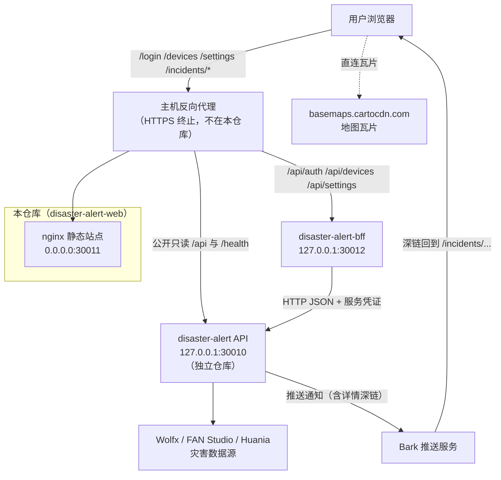
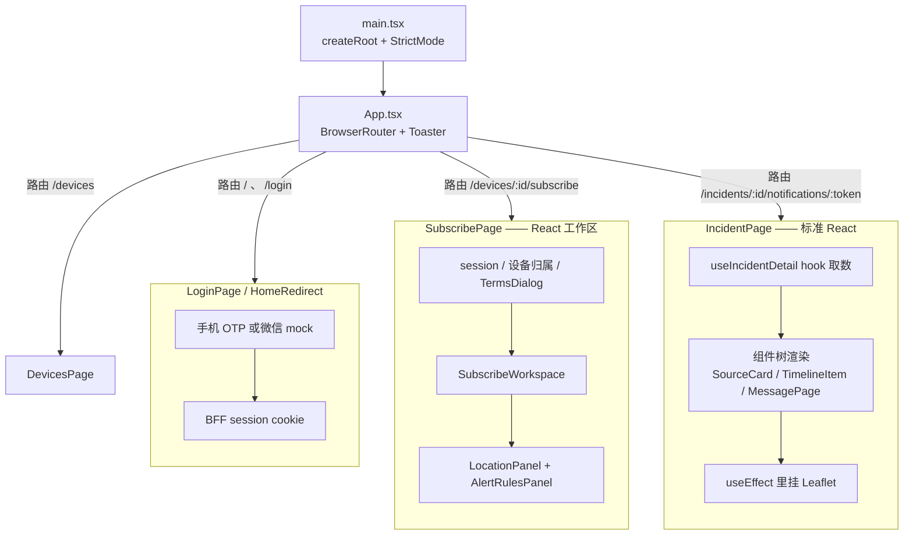
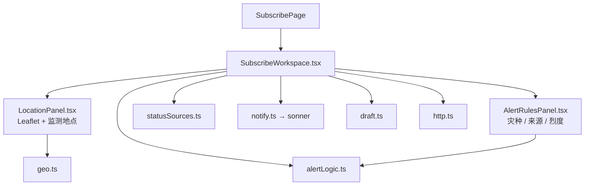
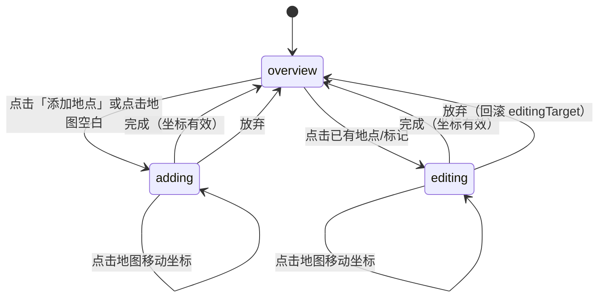
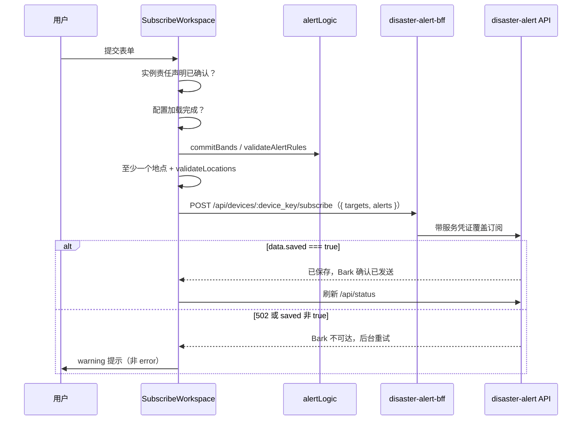
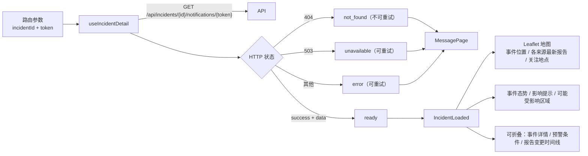
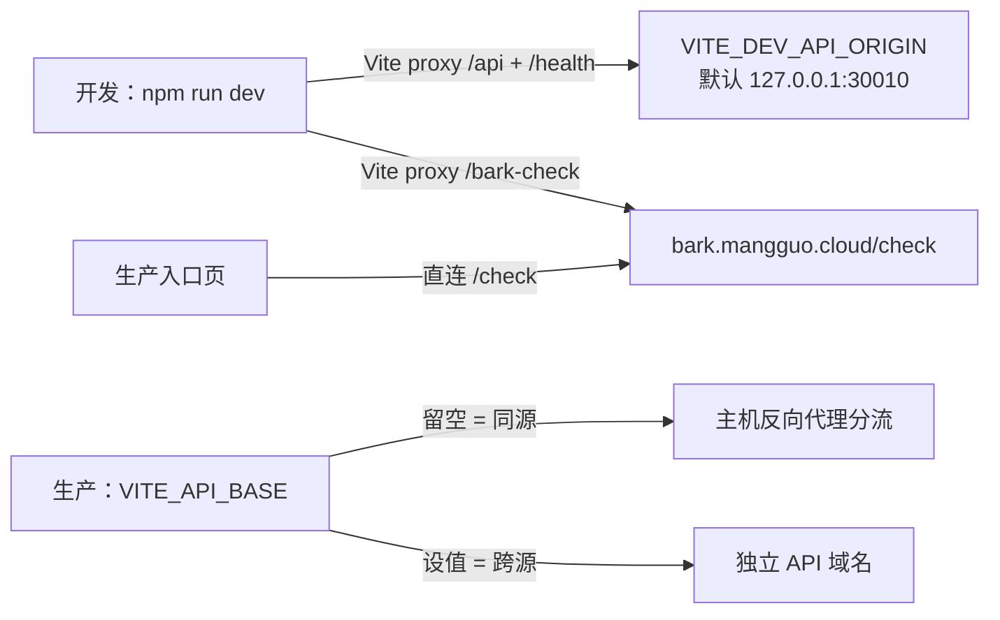
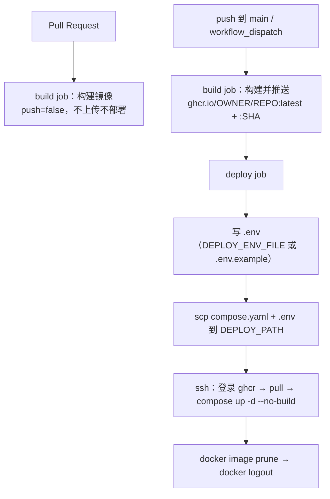

# 架构设计文档

`disaster-alert-web` — 灾害预警订阅前端。

本文描述本仓库**当前实际的**架构（而非规划中的架构），包含系统边界、模块划分、数据流、部署拓扑、关键设计决策，以及已识别的架构风险。

- 订阅页 React 模块拆分见 [subscribe-frontend.md](subscribe-frontend.md)。
- 账号登录与设备绑定见 [superpowers/specs/2026-09-01-account-login-design.md](superpowers/specs/2026-09-01-account-login-design.md)（源仓 [disaster-alert](https://github.com/luyi2008/disaster-alert)）。旧 PRD [bark-key-session-prd.md](bark-key-session-prd.md) 仅作历史对照。
- 后端契约快照见 [openapi.yaml](openapi.yaml)。
- 部署操作步骤见 [README](../README.md)。

---

## 1. 系统定位与边界

本仓库是一个**纯静态前端**，只负责两件事：让用户配置订阅，以及展示单条通知的详情。

它**不做**的事情：不采集灾害数据、不做规则匹配、不发送 Bark 推送、不持有用户账号或设备 token 目录。登录与设备资产在 [disaster-alert-bff](https://github.com/luyi2008/disaster-alert-bff)；匹配与推送在 [disaster-alert](https://github.com/luyi2008/disaster-alert)。

两个仓库**独立发版**，不需要对齐 git tag。这带来一个必然结果：契约靠人工维护的 `docs/openapi.yaml` 快照对齐，CI 不会拉取服务端仓库校验。

### 1.1 系统上下文



**关键边界特征：**

| 边界 | 说明 |
| --- | --- |
| 同源反代 | 站点与 API 共用域名时，由主机上的反向代理分流。容器自身**不代理** `/api`，单独部署容器无法完成订阅。 |
| 瓦片直连 | 地图瓦片由浏览器直接向 CDN 请求，不经过本站或 API。 |
| BFF 登录 | 浏览器只带 session cookie 访问 `/api/auth`、`/api/devices`、`/api/settings` 以及设备订阅读写。不把 Bark token 当站点身份，也不再请求 `/api/bark-urls` 或 `/check`。 |
| 闭环入口 | 详情页的唯一正常入口是 Bark 推送里的深链，路径中带通知凭据。 |

---

## 2. 技术栈

| 层 | 选型 | 版本 |
| --- | --- | --- |
| UI 框架 | React（含 `StrictMode`） | 19.2 |
| 路由 | react-router-dom（`BrowserRouter`） | 7.18 |
| 构建 | Vite | 8.2 |
| 语言 | TypeScript | ~6.0 |
| UI 组件 | shadcn/ui（new-york）+ Radix + Tailwind CSS | v4 |
| 提示 | sonner | 2.0 |
| 地图 | Leaflet | 1.9.4 |
| 测试 | Vitest + Testing Library + jsdom | 4.1 |
| Lint | oxlint | 1.75 |
| 运行时镜像 | nginx alpine | 1.27 |
| 构建镜像 | node bookworm | 22 |

没有引入状态管理库。交互控件走 `src/components/ui/`（Button、Input、NativeSelect、Switch、Checkbox、Tabs、Accordion、Alert、Card、Badge、Dialog、AlertDialog、DropdownMenu、NavigationMenu 等），主题变量接到现有 `tokens.css`（`--primary` 跟 `--text` 的 zinc 黑/白，light/dark 跟 `prefers-color-scheme`，不引入 `class="dark"` 开关）。页面级布局仍用手写 CSS（`ds.css` 的登录/壳层、`subscribe.css` 双栏、`detail.css` 地图叠层、`test.css` 状态条），地图继续 Leaflet。

---

## 3. 最重要的架构特征：整站 React，地图仍命令式

账号页、订阅页、测试页、详情页都是 React 路由。Leaflet 地图仍在 `useEffect` 里创建，卸载时 `map.remove()`。设备改名/解绑、取消订阅、重置规则走 shadcn `Dialog` / `AlertDialog`，不再调用 `window.prompt` / `window.confirm`。



### 3.1 订阅页为什么曾经是命令式的

订阅页来自原始静态 HTML。中间态是 `innerHTML` + `mountSubscribeApp`。该路径已经换成 `SubscribeWorkspace` 及其子组件；纯逻辑（`draft.ts`、`geo.ts`、`http.ts`、`mergeAlerts.ts`）保留。Leaflet 与逆地理编码仍是 effect 内的命令式生命周期。

---

## 4. 订阅页架构（`/devices/:id/subscribe`）

### 4.1 模块划分

`SubscribePage` 负责 session、设备归属、责任声明和 `AppShell`。共享草稿由 `SubscribeWorkspace` 持有，地点与规则面板通过 `setDraft` 更新。弹窗为 shadcn `AlertDialog`。



| 文件 | 职责 |
| --- | --- |
| `SubscribeWorkspace.tsx` | hydrate、保存、取消订阅、重置规则 |
| `LocationPanel.tsx` | Leaflet 地图与监测地点 |
| `AlertRulesPanel.tsx` | 灾害类别、来源、烈度规则 |
| `alertLogic.ts` | 规则 sanitize / 校验 |
| `statusSources.ts` | `/api/status` 已连接数据源标签 |
| `notify.ts` | sonner 提示 |
| `draft.ts` | 已保存订阅到表单草稿的映射 |
| `geo.ts` | 坐标解析与地点校验 |
| `http.ts` | API 响应解析与错误文案映射 |
| `types.ts` | 订阅草稿类型 |
| `html.ts` | `escapeHtml`（纯函数测试仍覆盖；UI 不再拼 `innerHTML`） |

### 4.2 异步与地图生命周期

**（一）Leaflet 仍在 effect 里**

`LocationPanel` 在 `useEffect` 里创建地图，cleanup 调用 `map.remove()`，并 abort 进行中的逆地理编码。地图点击处理读 `readyRef` / `uiRef` / `draftRef`，避免 effect 只跑一次时闭包过期。

**（二）生成代次（generation guard）**

`SubscribeWorkspace` 加载配置时用本地 `cancelled` 与递增 `generation`：卸载或新一轮加载到达后，旧响应不再 `setState`。React `StrictMode` 下的双次挂载让后者成为必然而非偶然。

**（三）坐标 / 区域 revision**

逆地理编码每个任务记下发起时的 `coordinateRevision` 和 `regionRevision`，回填前比对，避免过期结果覆盖人工输入。

### 4.3 地点编辑状态机

`LocationPanel` 围绕 `locationMode` 组织，最多 3 个监测地点：



进入 `editing` 时把目标深拷贝到 `editingTarget`，「放弃」即丢弃副本，实现无损回滚。坐标统一以 `toFixed(4)` 的**字符串**形式存储 —— 保留用户输入原样、避免浮点显示抖动，也让重复坐标判定有确定的精度基准。

**逆地理编码**：坐标变更后 350ms 防抖，调 `/api/reverse-geocode` 回填省/市/区。这里有一处容易被忽略的正确性设计 —— 每个任务记录发起时的 `coordinateRevision` 和 `regionRevision`，回填前比对：

- 坐标又变了 → 丢弃（结果已过期）
- 用户手工改过省市区 → 丢弃（不覆盖人工输入）

这两个 revision 计数器和 4.2 节的生成代次是同一思想在不同粒度上的应用。

### 4.4 服务端 hydrate 与内存编辑

订阅页用当前设备 `deviceKey` 请求 `GET /api/devices/:device_key/subscription`（BFF cookie），再由 `selectSavedSubscription` 取第一条记录。`draftFromSavedSubscription` 把该记录映射为表单草稿；灾种选项随后加载并与映射结果合并。HTTP 200 且 `success: false` 表示该设备没有订阅，页面从空配置开始。401 回 `/login`；设备不存在回 `/devices`。

表单编辑只保存在当前页面的内存中，提交时才通过 `POST /api/devices/:device_key/subscribe` 覆盖订阅（body 只有 `targets` 与 `alerts`，不含 `destination`）；刷新或离开页面会丢弃未提交修改。加载已保存订阅失败时会提示错误，但不会阻止用户继续编辑并保存。浏览器里遗留的 `disaster_subscription_draft_v3` 或 v2 键不会被读取，也不会被删除。

登录身份是 BFF HttpOnly cookie，不再使用 `disaster_bark_key`。Bark token 只在 `/devices` 绑定时提交一次。

「有未提交更改」的提示靠 `draftSignature`（草稿的稳定 JSON 序列化）与 hydrate 或最近成功提交后的 `lastSubmittedSignature` 比对。

### 4.5 提交流程



订阅是**覆盖**语义而非增量。全部校验在客户端先做一遍再发请求，服务端仍是权威校验方。

值得注意的是失败路径的分级：HTTP 502 被翻译成「Bark 接收测试失败，请检查 Bark Key」这样的可行动文案；而 `saved` 不为 `true` 时用 warning 而非 error —— 订阅已入库、只是确认推送待重试，报成错误会误导用户重复提交。

---

## 5. 详情页架构（`/incidents/:incidentId/notifications/:token`）

标准 React，与订阅页不共享任何代码（除 `src/api.ts` 的类型与 fetch 封装）。



**状态建模**：`useIncidentDetail` 把 HTTP 状态码收敛成五个语义状态（`loading` / `ready` / `not_found` / `unavailable` / `error`），并区分「可重试」与「不可重试」。404 不给重试按钮 —— 链接失效或凭据错误，重试无意义。

**地图**：`collectMapPoints` 把快照与事件视图折叠成三类点（`event` / `current` / `target`），事件点带 `radius_km` 时画影响圈，事件点与关注点之间连虚线示意距离。`useEffect` 依赖 `[points]`，返回的清理函数调 `map.remove()`。

**隐私加固**：组件挂载时动态注入 `<meta name="robots" content="noindex, nofollow, noarchive">` 并强制 `referrer=no-referrer`，卸载时移除。这是 nginx 响应头之外的第二道防线（见 7.1）。

---

## 6. 数据流与后端契约

### 6.1 全部后端调用

所有响应共用信封 `{ success: boolean, message: string, data?: T }`。

| 方法 | 路径 | 调用方 | 用途 |
| --- | --- | --- | --- |
| GET | `/api/status` | `statusSources.ts`、`api.ts` | 数据源健康、订阅数、队列深度、`instance_terms_accepted` |
| GET | `/api/subscription-options` | `SubscribeWorkspace.tsx` | 灾种、来源分组、默认规则 |
| GET | `/api/reverse-geocode` | `LocationPanel.tsx` | 坐标 → 省/市/区 |
| GET | `/api/devices/:device_key/subscription` | `api.ts` | 读取该设备已保存订阅 |
| POST | `/api/devices/:device_key/subscribe` | `api.ts` | 覆盖保存订阅 |
| DELETE | `/api/devices/:device_key/subscribe` | `api.ts` | 删除该设备服务端订阅 |
| GET / POST / PATCH / DELETE | `/api/devices` | `api.ts` | 设备列表与绑定 |
| GET | `/api/incidents/{id}/notifications/{token}` | `api.ts` | 通知详情 |
| GET | `/health` | 仅反代/开发代理 | 进程健康检查 |

`/api/subscription-options` 是一个重要的架构选择：**灾种、来源列表和默认规则由服务端下发，不在前端硬编码**。后端新增数据源或灾种，前端无需改代码。前端只保留渲染逻辑和各灾种的数值范围校验（如 `min_magnitude` 0–10、`min_severity` 1–4）。

### 6.2 API 基址解析



`api.ts` 的 `apiUrl()` 统一加前缀并去掉尾部斜杠。`VITE_API_BASE` 是**构建时**变量，会烘进产物 —— 同一镜像不能在运行时切换 API 地址。同源反代场景保持留空即可。

### 6.3 错误文案统一

`http.ts` 的 `parseApiResponse` 是订阅工作区请求解析的出口，做三件事：

1. 非 JSON 响应不抛异常，降级为失败信封（nginx 返回 HTML 错误页时不会炸掉调用方）。
2. `cleanApiMessage` 折叠空白、截断到 240 字符，并**丢弃看起来像 HTML 的 message** —— 避免把网关错误页原样喷给用户。
3. `httpFailureMessage` 把状态码映射成中文可行动文案（502/503/504 → 「服务暂时不可用」，429 → 「请求过于频繁」等）。

---

## 7. 横切关注点

### 7.1 安全与隐私

详情页 URL 的路径里含通知凭据，这是整个系统最需要保护的资产。防护是分层的：

| 层 | 措施 |
| --- | --- |
| nginx | `/incidents/` 上 `X-Robots-Tag: noindex, nofollow, noarchive` |
| nginx（全站） | `X-Content-Type-Options: nosniff`、`Referrer-Policy: no-referrer`、`X-Frame-Options: DENY` |
| `index.html` | `<meta name="referrer" content="no-referrer">` |
| `IncidentPage` | 运行时注入 robots / referrer meta |
| 运维（仓库外） | 反代、CDN、日志**不得**记录 `/incidents/` 完整 URL |
| localStorage | 不存登录身份（BFF HttpOnly cookie）；订阅配置从服务端读取，未提交编辑只在内存中 |

页面文案由 React 渲染，JSX 自动转义。`html.ts` 的 `escapeHtml` 仍有单测，但 UI 不再拼接 `innerHTML`。

### 7.2 无障碍与动效

- 语义化标签、`aria-labelledby` / `aria-label` / `aria-hidden` 覆盖主要区域。
- 确认/改名弹窗是 Radix Dialog / AlertDialog（键盘、焦点、点击外部）。责任声明 `TermsDialog` 禁止 Esc / 点遮罩关闭，必须点「已知悉」。
- Tailwind / `tw-animate-css` 尊重 `prefers-reduced-motion`。
- 暗色模式继续跟系统 `prefers-color-scheme`，不引入 class 开关。

### 7.3 提示语义分级

`notify.ts` 把分级交给 sonner，时长沿用原先语义：

| 类型 | 时长 | 是否常驻 |
| --- | --- | --- |
| `info` | 直到下一条非 info | 是（`toast.loading`） |
| `error` | 6000ms | 否 |
| `warning` | 4500ms | 否 |
| `success` | 3000ms | 否 |

`info` 用于「正在保存…」这类进行中状态；任意非 `info` 会 `toast.dismiss` 掉进度条。

---

## 8. 构建与部署架构

### 8.1 镜像

两阶段 Dockerfile：`node:22-bookworm` 里 `npm ci && npm run build`，产物 `dist/` 拷进 `nginx:1.27-alpine`。运行时镜像不含 Node 和源码。

容器内 nginx **始终**监听 `0.0.0.0:30011`（写死在 `nginx.conf`），对外发布端口由 Compose 的 `SERVER_PORT` / `SERVER_PUBLISH_HOST` 控制。`/`、`/subscribe` 与 `/incidents/` 都 `try_files ... /index.html`，保证 SPA 深链刷新不 404 —— 这是 Bark 深链能正常工作的前提。

镜像自带 `HEALTHCHECK`（wget 探活 `127.0.0.1:30011/`），Compose 侧重复定义了一份。

### 8.2 CI/CD



设计要点：

- **PR 只验证可构建性**，不产生任何可部署产物，也不接触部署密钥。
- 镜像仓库是 GitHub Container Registry（`ghcr.io`），不是 Docker Hub；用当次 job 的 `GITHUB_TOKEN` 登录，无需长期凭据。
- 部署用 `--no-build` 拉取 CI 产物，**不在生产主机上编译** —— 主机无需 Node 工具链，且部署的就是 CI 验证过的那个镜像。
- `latest` 与提交 SHA 双标签：`latest` 供 Compose 默认拉取，SHA 标签供回滚定位。
- 两个 job 的 concurrency 策略不同：build 用 `cancel-in-progress: true`（新提交作废旧构建），deploy 用 `false`（部署不可中断）。
- `DEPLOY_PATH` 必须与 API 仓库分开，否则两边互相覆盖 `compose.yaml`。

对外 HTTPS 与 `/api` 分流由主机上的反向代理处理，配置不在本仓库。

---

## 9. 质量保障

| 手段 | 现状 |
| --- | --- |
| 单测 | Vitest + Testing Library，覆盖登录、设备、订阅工作区、详情页 |
| 类型检查 | `tsc -b`（build 前置），项目引用拆 app / node 两份配置 |
| Lint | oxlint，启用 react + typescript + oxc 插件 |
| 构建 | Vite 单页产物；体积随 shadcn/Radix 上升，仍无路由级代码分割 |

测试覆盖的是**不变量而非快照**：

- `subscribe.logic.test.ts` / `mergeAlerts.test.ts` — 纯函数：错误文案、坐标校验、服务端订阅选择与草稿映射。
- `SubscribeWorkspace.test.tsx` — hydrate、保存、401、取消订阅 / 重置规则 AlertDialog、卸载时 `map.remove()`。
- `SubscribePage.test.tsx` — 设备缺失回列表；账号壳与返回设备。
- `DevicesPage.test.tsx` — 改名 Dialog、解绑 AlertDialog；取消不发请求。
- `LoginPage.test.tsx` / `AddDevicePage.test.tsx` / `SettingsPage.test.tsx` — 账号流。
- `TestPage.test.tsx` / `IncidentPage.test.tsx` / `TermsDialog.test.tsx` — 测试页、详情、责任声明。

Leaflet 在测试中被 `vi.mock` 替换，jsdom 无需真实地图实现。

---

## 10. 关键设计决策记录

| 决策 | 理由 | 代价 |
| --- | --- | --- |
| 前后端分仓、独立发版 | 前端可独立迭代，不被服务端发版节奏绑定 | 契约靠人工快照对齐，有漂移风险 |
| 订阅页改为 React 组件 | shadcn 弹窗必须挂在 React 树里，不能继续 `innerHTML` + `confirm()` | Leaflet 仍在 effect 里，闭包要用 ref |
| 共享草稿在 `SubscribeWorkspace` | 地点与规则面板通过 `setDraft` 更新，避免再引入 runtime 对象 | 面板仍共享一份草稿形状 |
| 生成代次 + revision 守卫 | 防止过期 hydrate / 逆地理编码写入 | 每个异步入口都必须记得比对 |
| 灾种/来源由服务端下发 | 后端扩展数据源无需改前端 | 前端需处理下发数据缺失/异常的降级 |
| 服务端订阅 hydrate 与本机会话分离 | 刷新读取权威已保存配置；登录是 BFF cookie | 未提交编辑只在内存中，刷新会丢失 |
| shadcn + 现有 tokens | 控件成熟，视觉仍是 zinc + 蓝主色 | 页面级布局 CSS 仍要手写 |
| 构建时注入 `VITE_API_BASE` | 同源部署下零配置 | 同一镜像无法在运行时切换 API 地址 |
| 容器固定 30011，HTTPS 交给外部反代 | 与 API 仓库部署约定一致，职责清晰 | 单独跑容器无法完成订阅（无 `/api`） |

---

## 11. 已识别的架构风险与改进建议

按建议优先级排列。以下均为**现状观察**，本文档未改动任何代码。

### 高优先级

**1. TypeScript 未开启 `strict`**

`tsconfig.app.json` 与 `tsconfig.node.json` 都没有 `strict`（也没有 `strictNullChecks` / `noImplicitAny`）。订阅工作区仍大量处理 `unknown` 的 API 响应。

建议：先开 `strictNullChecks`（收益最大），再逐步收紧到完整 `strict`。可先在 `subscribe/` 的纯函数模块试点。

**2. 契约漂移无自动防护**

`docs/openapi.yaml` 是人工维护的快照，CI 明确不拉取服务端仓库。后端改了字段，前端在运行时才会发现。

建议：至少为 `/api/subscription-options` 和 `/api/incidents/...` 的响应加运行时形状校验，把静默的 `undefined` 渲染转成明确的降级提示。或从 OpenAPI 生成类型，让快照与类型不同步时构建失败。

**3. Leaflet 生命周期仍是命令式的**

`LocationPanel` 与 `IncidentPage` 在 `useEffect` 里创建地图。点击处理必须走 ref，否则会读到过期的 `configurationReady` / 草稿。这比 `innerHTML` 好，但仍比纯 React 状态更容易写错。

建议：地图封装成 hook（创建/销毁/fitBounds），页面只传点和回调。

### 中优先级

**4. 无代码分割，Leaflet 全量进主包**

产物没有 `React.lazy` 或动态 `import()`。订阅工作区、账号页与详情页打进同一 JS chunk，从 Bark 深链进来只看详情页的用户仍要下载订阅编辑器。

灾害预警场景下首屏时延尤其敏感，且用户此时很可能在移动网络上。

建议：按路由分割页面，并把 Leaflet 拆成独立 chunk。

**5. 缺少 Error Boundary**

`App.tsx` 只有 `BrowserRouter` + `Routes`，没有错误边界。任何渲染期异常都会白屏。对于承载预警信息的页面，白屏比降级展示危险得多。

建议：在路由外层加错误边界，兜底渲染一个可重试的提示页（可复用 `MessagePage` 的样式）。

**6. nginx 未设置 CSP**

已有 `nosniff` / `no-referrer` / `DENY` 三个头，但没有 `Content-Security-Policy`。

建议：加一条允许 `'self'` 与瓦片 CDN 的 CSP；因存在内联样式，`style-src` 可能需要 `'unsafe-inline'`，需实测确认。

### 低优先级

**7. `IncidentPage` 用全局 `document.querySelector` 找自己的按钮**

```341:342:src/pages/IncidentPage.tsx
    const button = document.querySelector("#map-fit-button");
    button?.addEventListener("click", fit);
```

`#map-fit-button` 就在同一组件树里，用 `useRef` 更直接，也不受同页其他同 id 节点影响。这与订阅页「不要用全局 document 查节点」的约定精神一致（该约定文本目前只约束订阅页）。

**8. `useIncidentDetail` 的 lint warning**

oxlint 报 `react(set-state-in-effect)`。当前写法是 effect 内取数并 setState 的标准模式，功能正确，但会多一轮渲染。

建议：迁到 React 19 的数据获取模式，或显式标注抑制并说明理由，让 lint 输出保持干净（当前唯一一条 warning 会掩盖新引入的问题）。

**9. `MessagePage` 的重试用 `<a href="">`**

靠空 href 触发整页重载。可行但语义模糊，且会丢失 React 状态。建议改为按钮触发 hook 内的重新取数。

**10. `docs/` 与 `src/subscribe/README.md` 的职责重叠**

`src/subscribe/README.md` 与 [subscribe-frontend.md](subscribe-frontend.md) 都描述 React 模块表。保持短 README 指向长文即可，改模块时两处一起改。

---

## 12. 演进方向

订阅页命令式 DOM 已替换为 React。接下来更值得做的是：

1. 按路由代码分割，并把 Leaflet 拆成独立 chunk（第 11 节风险 4）。
2. 打开 `strictNullChecks`，从 `subscribe/` 纯函数模块试点。
3. 路由外层 Error Boundary。
4. 详情页 `MessagePage` 重试改为 hook 内重新取数，而不是 `<a href="">`。
