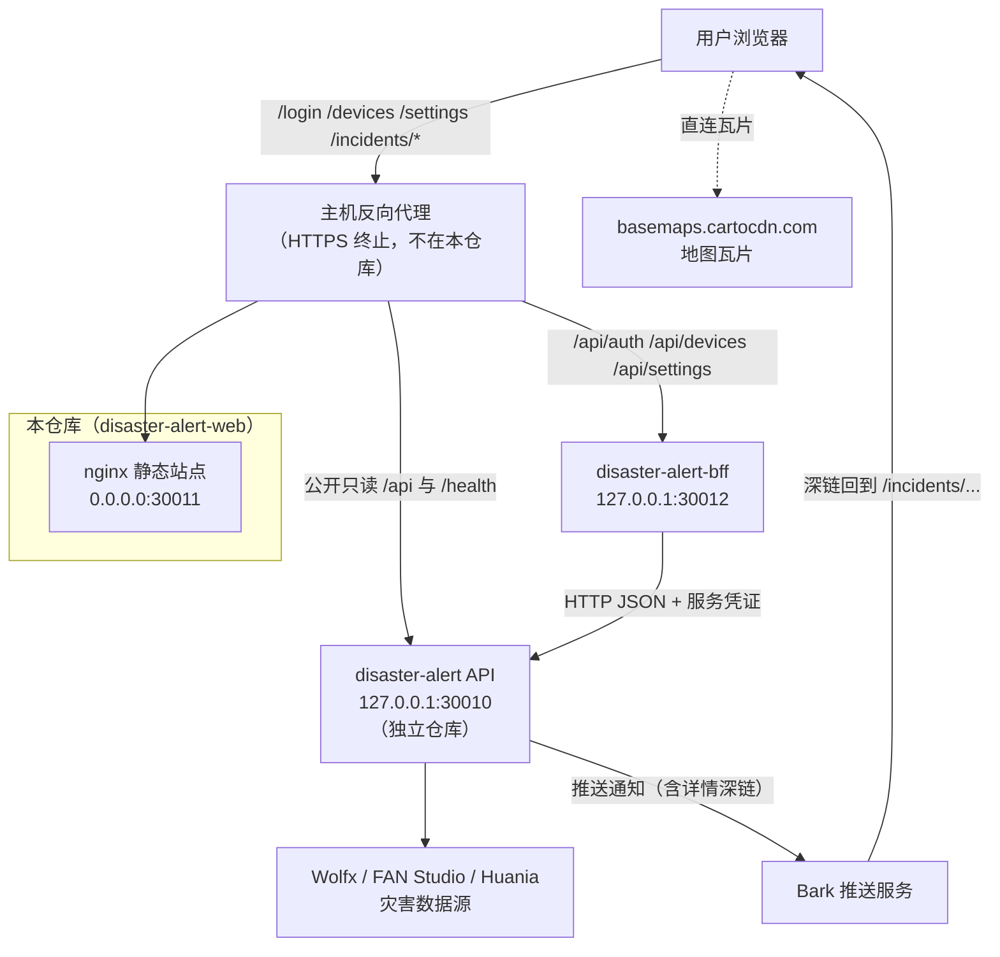
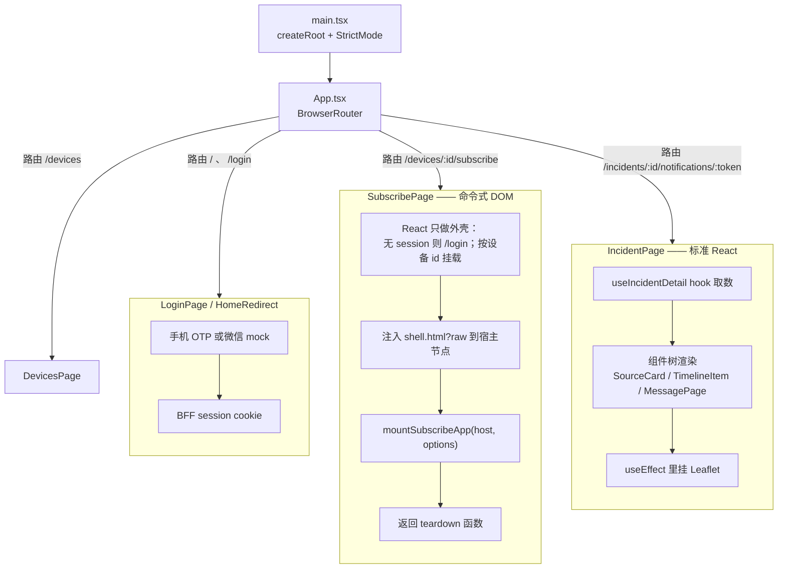
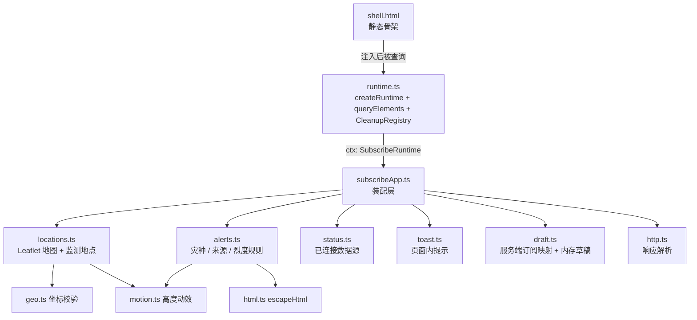
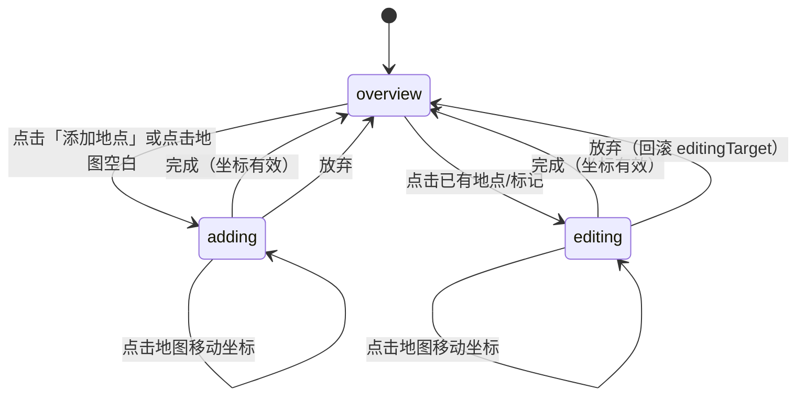
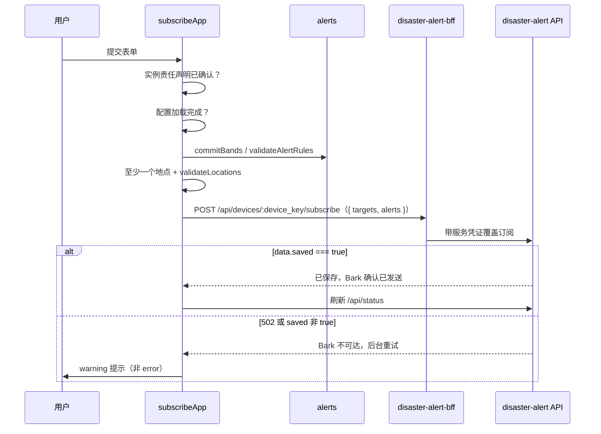
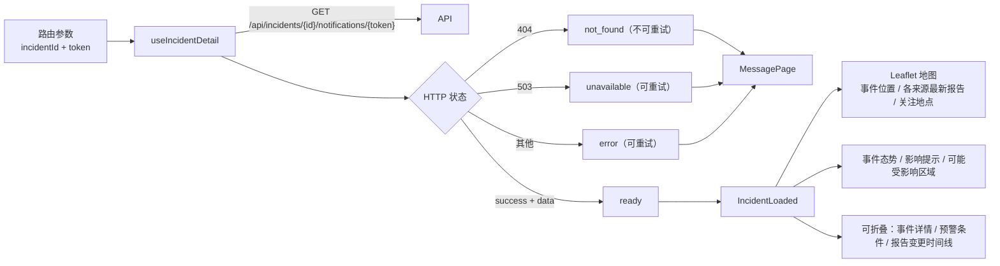
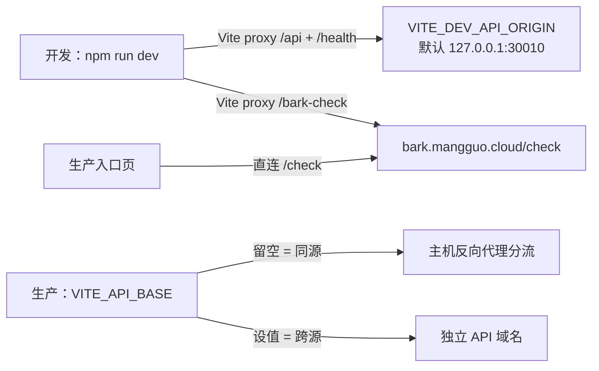
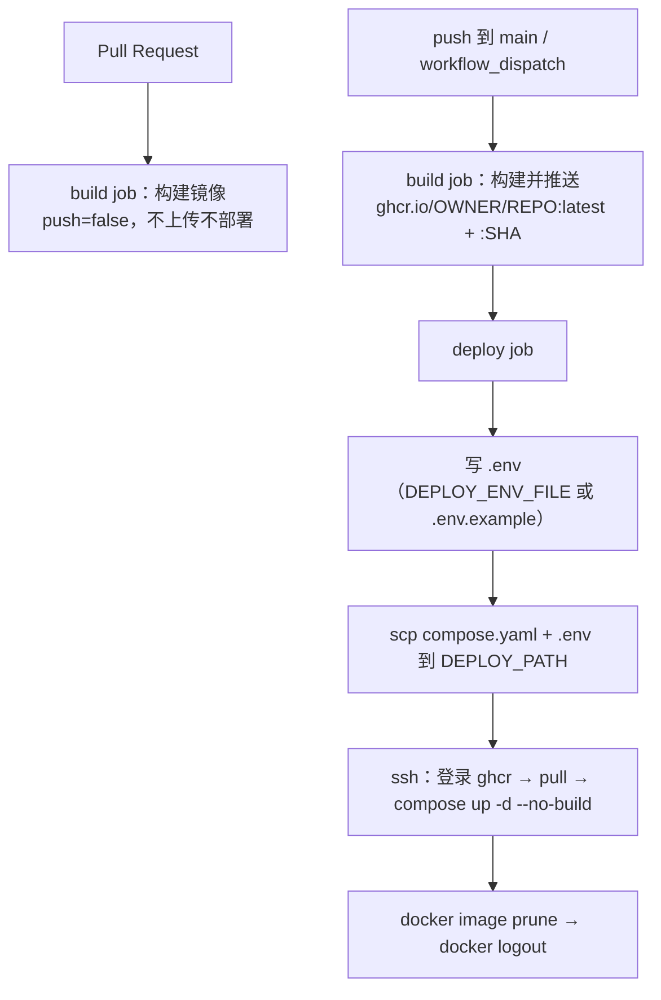

# 架构设计文档

`disaster-alert-web` — 灾害预警订阅前端。

本文描述本仓库**当前实际的**架构（而非规划中的架构），包含系统边界、模块划分、数据流、部署拓扑、关键设计决策，以及已识别的架构风险。

- 订阅页 DOM 层的具体拆分约定见 [subscribe-frontend.md](subscribe-frontend.md)。
- 账号登录与设备绑定见 [superpowers/specs/2026-09-01-account-login-design.md](superpowers/specs/2026-09-01-account-login-design.md)（源仓 [disaster-alert](https://github.com/luyi2008/disaster-alert)）。旧 PRD [bark-key-session-prd.md](bark-key-session-prd.md) 仅作历史对照。
- 后端契约快照见 [openapi.yaml](openapi.yaml)。
- 部署操作步骤见 [README](../README.md)。

---

## 1. 系统定位与边界

本仓库是一个**纯静态前端**，只负责两件事：让用户配置订阅，以及展示单条通知的详情。

它**不做**的事情：不采集灾害数据、不做规则匹配、不发送 Bark 推送、不持有用户账号或设备 token 目录。登录与设备资产在 [disaster-alert-bff](https://github.com/luyi2008/disaster-alert-bff)；匹配与推送在 [disaster-alert](https://github.com/luyi2008/disaster-alert)。

两个仓库**独立发版**，不需要对齐 git tag。这带来一个必然结果：契约靠人工维护的 `docs/openapi.yaml` 快照对齐，CI 不会拉取服务端仓库校验。

### 1.1 系统上下文



**关键边界特征：**

| 边界 | 说明 |
| --- | --- |
| 同源反代 | 站点与 API 共用域名时，由主机上的反向代理分流。容器自身**不代理** `/api`，单独部署容器无法完成订阅。 |
| 瓦片直连 | 地图瓦片由浏览器直接向 CDN 请求，不经过本站或 API。 |
| BFF 登录 | 浏览器只带 session cookie 访问 `/api/auth`、`/api/devices`、`/api/settings` 以及设备订阅读写。不把 Bark token 当站点身份，也不再请求 `/api/bark-urls` 或 `/check`。 |
| 闭环入口 | 详情页的唯一正常入口是 Bark 推送里的深链，路径中带通知凭据。 |

---

## 2. 技术栈

| 层 | 选型 | 版本 |
| --- | --- | --- |
| UI 框架 | React（含 `StrictMode`） | 19.2 |
| 路由 | react-router-dom（`BrowserRouter`） | 7.18 |
| 构建 | Vite | 8.2 |
| 语言 | TypeScript | ~6.0 |
| 地图 | Leaflet | 1.9.4 |
| 测试 | Vitest + Testing Library + jsdom | 4.1 |
| Lint | oxlint | 1.75 |
| 运行时镜像 | nginx alpine | 1.27 |
| 构建镜像 | node bookworm | 22 |

没有引入状态管理库、UI 组件库或 CSS 框架。样式是手写 CSS（`tokens.css` 色板、`entry.css`、`subscribe.css`、`detail.css`），通过 ES import 交给 Vite 打包。

---

## 3. 最重要的架构特征：双范式前端

这是理解本仓库的核心。订阅配置页仍是命令式 DOM（从原静态页迁入的中间态），入口页与详情页已是 React。



### 3.1 为什么订阅页是命令式的

订阅页是从一个原始静态 HTML 页面迁入的。整页一次性改写成 React 风险高（表单交互、Leaflet 地图、服务端配置回填、多层动效交织），因此采取的策略是：**先把命令式代码按职责拆成有类型的模块并补测试，再逐模块替换成 React**。

React 在这条路线上只承担三个职责：查询 `instance_terms_accepted`、渲染 `TermsDialog`、管理 `mountSubscribeApp` 的生命周期。

这个决策的代价是必须手工处理所有 React 免费提供的东西 —— 事件解绑、定时器清理、请求取消、地图销毁。这是 4.2 节 `CleanupRegistry` 存在的原因。

---

## 4. 订阅页架构（`/subscribe`）

### 4.1 模块划分

`src/subscribe/` 下 13 个实现文件（另有 2 个测试文件与 1 个指向文档的 README），所有共享可变状态集中在一个 `SubscribeRuntime` 对象里。跨模块通信**只**通过该 runtime 和各 `bind*` 函数返回的控制器对象，模块之间不直接互相 import 状态。



| 文件 | 行数 | 职责 |
| --- | --- | --- |
| `alerts.ts` | 593 | 灾害类别卡片、来源勾选、阈值与烈度区间编辑器 |
| `locations.ts` | 550 | Leaflet 地图、监测地点增删改、逆地理编码 |
| `subscribeApp.ts` | 284 | 装配：Bark 身份、提交/取消订阅、配置加载、teardown |
| `status.ts` | 60 | `/api/status` 已连接数据源，展示在预警类型标题后 |
| `runtime.ts` | 173 | 宿主节点查询、runtime 构造、清理登记表 |
| `types.ts` | 150 | 订阅草稿与运行时类型 |
| `shell.html` | 146 | 静态骨架（表单、地图容器） |
| `draft.ts` | 87 | 已保存订阅到表单草稿的映射、规范化与签名 |
| `toast.ts` | 80 | 提示堆栈 |
| `geo.ts` | 80 | 坐标解析与地点校验 |
| `http.ts` | 44 | API 响应解析与错误文案映射 |
| `motion.ts` | 26 | 展开/收起高度动效 |
| `html.ts` | 5 | HTML 转义 |

### 4.2 三个支撑整个命令式层的模式

命令式代码的正确性依赖三个反复出现的模式。理解它们比逐个读模块更重要。

**（一）`CleanupRegistry` —— 一次登记，一次收网**

`runtime.ts` 里的一个后进先出栈。任何注册监听、开定时器、创建地图的地方都同时登记撤销动作：

```22:41:src/subscribe/runtime.ts
  listen(
    target: EventTarget,
    type: string,
    listener: EventListener,
    options?: boolean | AddEventListenerOptions,
  ): void {
    target.addEventListener(type, listener, options);
    this.add(() => target.removeEventListener(type, listener, options));
  }

  run(): void {
    while (this.fns.length > 0) {
      const fn = this.fns.pop();
      try {
        fn?.();
      } catch {
        // Continue remaining teardown even if one listener fails.
      }
    }
  }
```

`run()` 里的 try/catch 保证单个撤销失败不会中断后续清理 —— 否则一个抛错的监听器会把地图和定时器永久泄漏。

**（二）宿主作用域查询**

所有 `#id` 选择器从传入的宿主 `root` 查，而不是 `document`。这样订阅页工作区不会和责任声明弹窗、或其他路由的 DOM 抢同名节点。`queryElements` 在挂载时一次性把 52 个节点解析成有类型的 `SubscribeElements`，缺任何一个立即抛错 —— 骨架与代码不同步会在挂载时快速失败，而不是在某次点击时静默失效。

**（三）生成代次（generation guard）**

`ctx.initializationGeneration` 是一个单调递增计数器。每次重新加载配置时自增；teardown 时也自增。所有异步回调在写 DOM 前先比对代次：

```91:93:src/subscribe/subscribeApp.ts
    const res = await fetch(`${ctx.api}/api/bark-urls`);
    const json = await parseApiResponse(res);
    if (generation !== ctx.initializationGeneration) return;
```

这解决两类竞态：用户连续点「重试」导致的旧响应覆盖新状态，以及组件卸载后到达的响应写入已销毁的 DOM。React `StrictMode` 下的双次挂载让后者成为必然而非偶然。

### 4.3 地点编辑状态机

`locations.ts` 围绕 `ctx.uiState.locationMode` 组织，最多 3 个监测地点：



进入 `editing` 时把目标深拷贝到 `ctx.uiState.editingTarget`，「放弃」即丢弃副本，实现无损回滚。坐标统一以 `toFixed(4)` 的**字符串**形式存储 —— 保留用户输入原样、避免浮点显示抖动，也让重复坐标判定有确定的精度基准。

**逆地理编码**：坐标变更后 350ms 防抖，调 `/api/reverse-geocode` 回填省/市/区。这里有一处容易被忽略的正确性设计 —— 每个任务记录发起时的 `coordinateRevision` 和 `regionRevision`，回填前比对：

- 坐标又变了 → 丢弃（结果已过期）
- 用户手工改过省市区 → 丢弃（不覆盖人工输入）

这两个 revision 计数器和 4.2 节的生成代次是同一思想在不同粒度上的应用。

### 4.4 服务端 hydrate 与内存编辑

订阅页用当前设备 `deviceKey` 请求 `GET /api/devices/:device_key/subscription`（BFF cookie），再由 `selectSavedSubscription` 取第一条记录。`draftFromSavedSubscription` 把该记录映射为表单草稿；灾种选项随后加载并与映射结果合并。HTTP 200 且 `success: false` 表示该设备没有订阅，页面从空配置开始。401 回 `/login`；设备不存在回 `/devices`。

表单编辑只保存在当前页面的内存中，提交时才通过 `POST /api/devices/:device_key/subscribe` 覆盖订阅（body 只有 `targets` 与 `alerts`，不含 `destination`）；刷新或离开页面会丢弃未提交修改。加载已保存订阅失败时会提示错误，但不会阻止用户继续编辑并保存。浏览器里遗留的 `disaster_subscription_draft_v3` 或 v2 键不会被读取，也不会被删除。

登录身份是 BFF HttpOnly cookie，不再使用 `disaster_bark_key`。Bark token 只在 `/devices` 绑定时提交一次。

「有未提交更改」的提示靠 `draftSignature`（草稿的稳定 JSON 序列化）与 hydrate 或最近成功提交后的 `lastSubmittedSignature` 比对。

### 4.5 提交流程



订阅是**覆盖**语义而非增量。全部校验在客户端先做一遍再发请求，服务端仍是权威校验方。

值得注意的是失败路径的分级：HTTP 502 被翻译成「Bark 接收测试失败，请检查 Bark Key」这样的可行动文案；而 `saved` 不为 `true` 时用 warning 而非 error —— 订阅已入库、只是确认推送待重试，报成错误会误导用户重复提交。

---

## 5. 详情页架构（`/incidents/:incidentId/notifications/:token`）

标准 React，与订阅页不共享任何代码（除 `src/api.ts` 的类型与 fetch 封装）。



**状态建模**：`useIncidentDetail` 把 HTTP 状态码收敛成五个语义状态（`loading` / `ready` / `not_found` / `unavailable` / `error`），并区分「可重试」与「不可重试」。404 不给重试按钮 —— 链接失效或凭据错误，重试无意义。

**地图**：`collectMapPoints` 把快照与事件视图折叠成三类点（`event` / `current` / `target`），事件点带 `radius_km` 时画影响圈，事件点与关注点之间连虚线示意距离。`useEffect` 依赖 `[points]`，返回的清理函数调 `map.remove()`。

**隐私加固**：组件挂载时动态注入 `<meta name="robots" content="noindex, nofollow, noarchive">` 并强制 `referrer=no-referrer`，卸载时移除。这是 nginx 响应头之外的第二道防线（见 7.1）。

---

## 6. 数据流与后端契约

### 6.1 全部后端调用

所有响应共用信封 `{ success: boolean, message: string, data?: T }`。

| 方法 | 路径 | 调用方 | 用途 |
| --- | --- | --- | --- |
| GET | `/api/status` | `status.ts`、`api.ts` | 数据源健康、订阅数、队列深度、`instance_terms_accepted` |
| GET | `/api/bark-urls` | `subscribeApp.ts` | 可选 Bark 服务白名单 |
| GET | `/api/subscriptions` | `subscribeApp.ts`、`TestPage.tsx` | 按 Bearer Bark Key 读取已保存订阅并回填表单/测试预览 |
| GET | `/api/subscription-options` | `alerts.ts` | 灾种、来源分组、默认规则 |
| GET | `/api/reverse-geocode` | `locations.ts` | 坐标 → 省/市/区 |
| POST | `/api/subscribe` | `subscribeApp.ts` | 覆盖保存订阅 |
| DELETE | `/api/unsubscribe` | `subscribeApp.ts` | 按 Bark 服务 + Key 删除订阅 |
| GET | `/api/incidents/{id}/notifications/{token}` | `api.ts` | 通知详情 |
| GET | `https://bark.mangguo.cloud/check` | `checkDeviceKey.ts` | 校验 Bark Key 格式与是否已注册（开发走 Vite `/bark-check`） |
| GET | `/health` | 仅反代/开发代理 | 进程健康检查 |

`/api/subscription-options` 是一个重要的架构选择：**灾种、来源列表和默认规则由服务端下发，不在前端硬编码**。后端新增数据源或灾种，前端无需改代码。前端只保留渲染逻辑和各灾种的数值范围校验（如 `min_magnitude` 0–10、`min_severity` 1–4）。

### 6.2 API 基址解析



`api.ts` 的 `apiUrl()` 统一加前缀并去掉尾部斜杠。`VITE_API_BASE` 是**构建时**变量，会烘进产物 —— 同一镜像不能在运行时切换 API 地址。同源反代场景保持留空即可。

### 6.3 错误文案统一

`http.ts` 的 `parseApiResponse` 是所有命令式层请求的唯一出口，做三件事：

1. 非 JSON 响应不抛异常，降级为失败信封（nginx 返回 HTML 错误页时不会炸掉调用方）。
2. `cleanApiMessage` 折叠空白、截断到 240 字符，并**丢弃看起来像 HTML 的 message** —— 避免把网关错误页原样喷给用户。
3. `httpFailureMessage` 把状态码映射成中文可行动文案（502/503/504 → 「服务暂时不可用」，429 → 「请求过于频繁」等）。

---

## 7. 横切关注点

### 7.1 安全与隐私

详情页 URL 的路径里含通知凭据，这是整个系统最需要保护的资产。防护是分层的：

| 层 | 措施 |
| --- | --- |
| nginx | `/incidents/` 上 `X-Robots-Tag: noindex, nofollow, noarchive` |
| nginx（全站） | `X-Content-Type-Options: nosniff`、`Referrer-Policy: no-referrer`、`X-Frame-Options: DENY` |
| `index.html` | `<meta name="referrer" content="no-referrer">` |
| `IncidentPage` | 运行时注入 robots / referrer meta |
| 运维（仓库外） | 反代、CDN、日志**不得**记录 `/incidents/` 完整 URL |
| localStorage | 仅保存登录身份 `disaster_bark_key`；订阅配置从服务端读取，未提交编辑只在内存中 |

`escapeHtml` 用于所有拼接进 `innerHTML` 的动态值（Bark URL 下拉、灾种卡片等）。**这条防线依赖人工纪律** —— 命令式层用 `innerHTML` 拼模板，漏一次转义就是一个 XSS 缺口。这是 3.1 节所述范式选择的直接代价。

### 7.2 无障碍与动效

- 语义化标签、`aria-labelledby` / `aria-label` / `aria-hidden` 覆盖两个页面的主要区域。
- 状态弹出层支持键盘（Escape 关闭）、焦点进出、点击外部关闭。
- `motion.ts` 与 `toast.ts` 均检测 `prefers-reduced-motion: reduce`，命中时跳过动画直接落到终态。
- 责任声明弹窗优先用原生 `<dialog>.showModal()`，不支持时降级为 `open` 属性。

### 7.3 提示语义分级

`toast.ts` 的分级决定了用户对失败的感知：

| 类型 | 时长 | 是否常驻 |
| --- | --- | --- |
| `info` | 手动关闭 | 是 |
| `error` | 6000ms | 否 |
| `warning` | 4500ms | 否 |
| `success` | 3000ms | 否 |

`info` 常驻用于「正在加载…」这类进行中状态，任何非 `info` 提示会自动清掉待决的常驻提示 —— 结果到达即取代进度提示。最多同时 5 条。

---

## 8. 构建与部署架构

### 8.1 镜像

两阶段 Dockerfile：`node:22-bookworm` 里 `npm ci && npm run build`，产物 `dist/` 拷进 `nginx:1.27-alpine`。运行时镜像不含 Node 和源码。

容器内 nginx **始终**监听 `0.0.0.0:30011`（写死在 `nginx.conf`），对外发布端口由 Compose 的 `SERVER_PORT` / `SERVER_PUBLISH_HOST` 控制。`/`、`/subscribe` 与 `/incidents/` 都 `try_files ... /index.html`，保证 SPA 深链刷新不 404 —— 这是 Bark 深链能正常工作的前提。

镜像自带 `HEALTHCHECK`（wget 探活 `127.0.0.1:30011/`），Compose 侧重复定义了一份。

### 8.2 CI/CD



设计要点：

- **PR 只验证可构建性**，不产生任何可部署产物，也不接触部署密钥。
- 镜像仓库是 GitHub Container Registry（`ghcr.io`），不是 Docker Hub；用当次 job 的 `GITHUB_TOKEN` 登录，无需长期凭据。
- 部署用 `--no-build` 拉取 CI 产物，**不在生产主机上编译** —— 主机无需 Node 工具链，且部署的就是 CI 验证过的那个镜像。
- `latest` 与提交 SHA 双标签：`latest` 供 Compose 默认拉取，SHA 标签供回滚定位。
- 两个 job 的 concurrency 策略不同：build 用 `cancel-in-progress: true`（新提交作废旧构建），deploy 用 `false`（部署不可中断）。
- `DEPLOY_PATH` 必须与 API 仓库分开，否则两边互相覆盖 `compose.yaml`。

对外 HTTPS 与 `/api` 分流由主机上的反向代理处理，配置不在本仓库。

---

## 9. 质量保障

| 手段 | 现状 |
| --- | --- |
| 单测 | 9 个文件，覆盖入口校验、订阅挂载与详情页 |
| 类型检查 | `tsc -b`（build 前置），项目引用拆 app / node 两份配置 |
| Lint | oxlint，启用 react + typescript + oxc 插件；当前 1 条 warning |
| 构建 | 44 模块 → JS 459.39 kB（gzip 140.06 kB）、CSS 62.64 kB（gzip 16.75 kB） |

测试覆盖的是**不变量而非快照**，四个文件各守一类风险：

- `api.subscriptions.test.ts` — Bearer `GET /api/subscriptions` 的请求与响应透传。
- `subscribe.logic.test.ts` — 纯函数：HTML 转义、错误文案映射、坐标校验、服务端订阅选择与表单草稿映射。
- `extractBarkKey` / `localValidate` / `checkDeviceKey` / `session` — 测试链接提取、22 位本地校验、check 信封解析、登录会话与 `/check` 复核。
- `BarkKeyPage.test.tsx` — 非法输入与未注册时按钮禁用；校验通过后写入会话并进入 `/subscribe`；已有会话则自动跳转。
- `SubscribePage.test.tsx` — 无会话时重定向回 `/`；仅有缓存时仍能打开订阅页。
- `subscribeApp.test.ts` — 挂载/卸载契约、服务端订阅 hydrate、空结果与失败降级，以及提交后的内存基线。
- `TestPage.test.tsx` — 从服务端订阅生成测试预览、无订阅提示和 Bearer 会话失效处理。
- `IncidentPage.test.tsx` — 详情页渲染与状态分支。
- `TermsDialog.test.tsx` — 弹窗行为。

Leaflet 在测试中被 `vi.mock` 替换，jsdom 无需真实地图实现。

---

## 10. 关键设计决策记录

| 决策 | 理由 | 代价 |
| --- | --- | --- |
| 前后端分仓、独立发版 | 前端可独立迭代，不被服务端发版节奏绑定 | 契约靠人工快照对齐，有漂移风险 |
| 订阅页保留命令式 DOM | 避免整页重写的高风险，先拆模块补测试再逐步替换 | 需手工管理清理；`innerHTML` 带来 XSS 面 |
| 单一 `SubscribeRuntime` 承载共享状态 | 命令式层无 React 状态机制，需要显式的单一真相源 | runtime 字段较多，模块耦合于其结构 |
| 生成代次 + revision 守卫 | 无框架托管时，这是防止过期响应写入 DOM 的最简手段 | 每个异步入口都必须记得比对 |
| 灾种/来源由服务端下发 | 后端扩展数据源无需改前端 | 前端需处理下发数据缺失/异常的降级 |
| 服务端订阅 hydrate 与本机会话分离 | 刷新读取权威已保存配置；有效性只认 `/check` | 未提交编辑只在内存中，刷新会丢失 |
| 入口页 `/check` 通过后写入会话 | 避免无效 Key 进入复杂配置；生产直连 bark check，开发走 Vite 代理 | 依赖 bark-worker-server CORS；`disaster-alert` 的 401/502 不能单独登出 |
| 构建时注入 `VITE_API_BASE` | 同源部署下零配置 | 同一镜像无法在运行时切换 API 地址 |
| 容器固定 30011，HTTPS 交给外部反代 | 与 API 仓库部署约定一致，职责清晰 | 单独跑容器无法完成订阅（无 `/api`） |

---

## 11. 已识别的架构风险与改进建议

按建议优先级排列。以下均为**现状观察**，本文档未改动任何代码。

### 高优先级

**1. TypeScript 未开启 `strict`**

`tsconfig.app.json` 与 `tsconfig.node.json` 都没有 `strict`（也没有 `strictNullChecks` / `noImplicitAny`）。命令式层大量处理 `unknown` 的 API 响应和可能为 null 的 DOM 节点，正是最需要严格空值检查的地方。

建议：先开 `strictNullChecks`（收益最大），再逐步收紧到完整 `strict`。可先在 `subscribe/` 的纯函数模块试点。

**2. 契约漂移无自动防护**

`docs/openapi.yaml` 是人工维护的快照，CI 明确不拉取服务端仓库。后端改了字段，前端在运行时才会发现。

建议：至少为 `/api/subscription-options` 和 `/api/incidents/...` 的响应加运行时形状校验，把静默的 `undefined` 渲染转成明确的降级提示。或从 OpenAPI 生成类型，让快照与类型不同步时构建失败。

**3. `innerHTML` 依赖人工转义**

`locations.ts`（4 处）、`alerts.ts`（2 处）、`toast.ts`、`subscribeApp.ts` 都用 `innerHTML` 拼接。已逐处核查：当前**所有**插值都经过 `escapeHtml`，且该函数同时转义 `& < > ' "`，文本与属性上下文都安全。但这是纪律约束而非机制约束 —— 新增一行模板时漏一次调用，不会有任何工具报错。

建议：这些模块本就在计划中要迁往 React（届时自动获得转义）。在此之前，可考虑把高频拼接改为 `textContent` + `createElement`，或加一条禁止裸 `innerHTML` 的 lint 规则。

### 中优先级

**4. 无代码分割，Leaflet 全量进主包**

产物是单个 459 kB 的 JS chunk（gzip 140 kB），源码里没有任何 `React.lazy` 或动态 `import()`。两个页面都用 Leaflet，但订阅页与详情页的其余逻辑完全不共享 —— 从 Bark 深链进来只看详情页的用户，仍要下载整个订阅页工作区（`alerts.ts` + `locations.ts` 约 1100 行加全部 CSS）。

灾害预警场景下首屏时延尤其敏感，且用户此时很可能在移动网络上。

建议：按路由分割两个页面，并把 Leaflet 拆成独立 chunk。

**5. 缺少 Error Boundary**

`App.tsx` 只有 `BrowserRouter` + `Routes`，没有错误边界。任何渲染期异常都会白屏。对于承载预警信息的页面，白屏比降级展示危险得多。

建议：在路由外层加错误边界，兜底渲染一个可重试的提示页（可复用 `MessagePage` 的样式）。

**6. nginx 未设置 CSP**

已有 `nosniff` / `no-referrer` / `DENY` 三个头，但没有 `Content-Security-Policy`。考虑到命令式层大量使用 `innerHTML`，CSP 会是很有价值的第二道防线。

建议：加一条允许 `'self'` 与瓦片 CDN 的 CSP；因存在内联样式，`style-src` 可能需要 `'unsafe-inline'`，需实测确认。

### 低优先级

**7. `IncidentPage` 用全局 `document.querySelector` 找自己的按钮**

```341:342:src/pages/IncidentPage.tsx
    const button = document.querySelector("#map-fit-button");
    button?.addEventListener("click", fit);
```

`#map-fit-button` 就在同一组件树里，用 `useRef` 更直接，也不受同页其他同 id 节点影响。这与订阅页「不要用全局 document 查节点」的约定精神一致（该约定文本目前只约束订阅页）。

**8. `useIncidentDetail` 的 lint warning**

oxlint 报 `react(set-state-in-effect)`。当前写法是 effect 内取数并 setState 的标准模式，功能正确，但会多一轮渲染。

建议：迁到 React 19 的数据获取模式，或显式标注抑制并说明理由，让 lint 输出保持干净（当前唯一一条 warning 会掩盖新引入的问题）。

**9. `MessagePage` 的重试用 `<a href="">`**

靠空 href 触发整页重载。可行但语义模糊，且会丢失 React 状态。建议改为按钮触发 hook 内的重新取数。

**10. `docs/` 与 `src/subscribe/README.md` 的职责重叠**

`src/subscribe/README.md` 仅 5 行、指向 `docs/subscribe-frontend.md`。保持现状可以，但需注意订阅页迁往 React 时三处文档（本文、`subscribe-frontend.md`、模块 README）需同步更新。

---

## 12. 演进方向

订阅页迁往 React 的路径已在 [subscribe-frontend.md](subscribe-frontend.md) 中确立：**模块稳定且有测试之后，才逐模块替换，不整页重写**。按依赖关系，风险从低到高的顺序大致是：

1. `toast.ts` —— 无业务状态，纯展示，可独立替换为组件。
2. `status.ts` —— 只读 `/api/status`，把已连接数据源写进预警类型标题。
3. `alerts.ts` —— 状态集中在 `alerts_by_category`，边界清晰。
4. `locations.ts` —— 最后做。Leaflet 命令式生命周期与状态机交织最深。

替换过程中 `SubscribeRuntime` 会逐步瘦身，最终消失。第 11 节的风险 3（`innerHTML`）和风险 4（代码分割）会随这条路径自然缓解，因此不建议为它们做与迁移方向冲突的临时改造。
