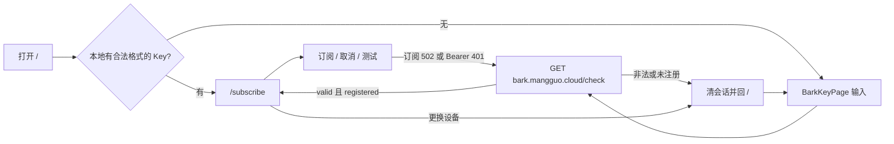

# PRD：Bark Key 作为站点登录身份

本文是产品需求，描述「Bark Key 当作本机登录账号」这一能力要解决什么问题、用户怎么走、以及有效/失效由谁判定。实现细节与模块拆分见 [architecture.md](architecture.md)、[subscribe-frontend.md](subscribe-frontend.md)。

状态：已在本仓库落地（入口页、订阅页、测试页共用同一套会话）。

---

## 1. 背景与问题

此前 Bark Key 只存在 React Router 的 `location.state` 里：

- 打开 `/` 总会停留在输入页，即使用户刚刚校验过同一把 Key。
- 刷新 `/subscribe` 会丢掉 state，被踢回输入页。
- 「更换设备」只是链到 `/`，没有可清的本地身份。
- 架构上曾写「Bark Key 绝不落盘」。那是把 Key 当一次性凭据，和「下次打开站点应认出这台设备」冲突。

用户把 Bark Key 理解成**这个站点的登录账号**（没有密码）：校验通过就记住；主动换设备或确认 Key 已失效时再要求重新输入。

## 2. 目标与非目标

### 目标

- 入口页经 `bark.mangguo.cloud/check` 确认 Key **格式合法且已在 Bark 注册** 后，把 Key 写入本机，作为登录会话。
- 之后打开 `/`，只要本地还有合法格式的会话，就直接进入订阅页，不再填一次。
- 「更换设备」清除会话并回到输入页，且不会立刻被弹回订阅页。
- 订阅提交、测试推送等与后端交互**看起来像 Key 出了问题**时，必须再问一次 `/check`；只有 `/check` 判定非法或未注册，才清会话并回到输入页。
- 订阅草稿（地点、规则）与登录身份分键存储：登出不抹掉地点草稿。

### 非目标

- 不引入密码、邮箱或其它账号体系。
- 不把 Key 写入订阅草稿 JSON，也不把草稿 schema 升版本。
- 打开 `/` 或刷新订阅页时**不**为了「还记不记得我」再打 `/check`（避免 check 宕机把已登录用户锁在输入页）。
- 不把 `disaster-alert` 的 HTTP 状态单独当成「Key 已失效」。该 API 只校验字符串格式，不知道 Key 是否仍在 Bark 注册。
- 不改路由表（仍是 `/`、`/subscribe`、`/subscribe/test`）。

## 3. 角色与场景

| 谁 | 想做什么 | 成功标准 |
| --- | --- | --- |
| 第一次来的用户 | 粘贴 Bark 测试链接，进订阅配置 | `/check` 通过后进入 `/subscribe`，下次打开 `/` 不再填 Key |
| 回访用户 | 打开站点继续改订阅或做测试 | `/` 自动进订阅页；刷新 `/subscribe` 仍认这把 Key |
| 换手机 / 换 Bark 设备的用户 | 不再用当前 Key | 点「更换设备」后看到输入页，刷新仍停在输入页 |
| 密钥已在 Bark 侧失效的用户 | 提交或测试时被明确要求重登 | 仅当 `/check` 确认非法或未注册时回到输入页；Bark 或网关暂时不可用时仍留在当前页并看到原错误 |

通知详情页 `/incidents/...` 不走这套登录；深链凭据在路径里，与 Bark Key 会话无关。

## 4. 有效性规则（产品硬约束）

**只有 `GET https://bark.mangguo.cloud/check?device_key=...` 能判定 Key 是否有效。**

通过条件：`data.valid === true` 且 `data.registered === true`。

| 来源 | 能证明什么 | 能否单独登出 |
| --- | --- | --- |
| 入口页 `/check` | 格式 + 是否已在 Bark 注册 | 登录的唯一写入条件 |
| 本地 `localValidateBarkKey`（22 位字母数字） | 本机缓存没坏 | 缓存损坏则视为未登录，不必打 `/check` |
| `disaster-alert` 401 / 400 / 502 | 格式、推送被拒或网关问题 | **否**。最多触发一次 `/check` 复核 |
| `/api/simulate` 404 | 该 Key 没有已激活订阅 | 否 |
| `/check` 超时、非 2xx、网络错误 | 无法判定 | **否**，保留会话，展示原错误 |

## 5. 主流程

### 5.1 登录

1. 用户在 `/` 粘贴测试链接或 22 位 Key。
2. 本地提取并校验格式；通过后请求 `/check`。
3. 仅当 valid 且 registered：写入 `localStorage` 键 `disaster_bark_key`，进入 `/subscribe`。
4. 未通过则按钮保持禁用，不写会话。

### 5.2 回访

1. 打开 `/`，本地 Key 格式合法 → `replace` 到 `/subscribe`（此步不打 `/check`）。
2. `/subscribe` 与 `/subscribe/test` 用路由 state 或本地会话解析当前账号；都没有则回 `/`。

### 5.3 主动登出

订阅页与测试页共用「更换设备」：先清 `disaster_bark_key`，再去 `/`。输入页读到空会话，展示表单。

### 5.4 可疑失败后复核

`disaster-alert` 的失败只是信号，不是结论。

触发复核：

- `POST /api/subscribe` 返回 502
- `POST /api/simulate` 或带 Bearer 的 `GET /api/history` 返回 401
- 当前使用的 Key 已过不了本地 22 位格式：直接登出，不打 `/check`

复核：

- `/check` → 非法或未注册：清会话，回到 `/`，要求重新输入
- `/check` → 仍通过，或 check 不可用：不登出，展示原来的 API / 网络错误

不登出：测试 404（没有订阅）、503、地点/规则校验失败、`/check` 自己失败。

## 6. 存储约定

| 键 | 内容 | 生命周期 |
| --- | --- | --- |
| `disaster_bark_key` | 已通过 `/check` 的 22 位 Key | 登录写入；更换设备或 `/check` 复核失败时清除；本地格式非法时丢弃 |
| `disaster_subscription_draft_v3` | 地点、规则、Bark URL | 与登录无关；登出保留 |

草稿 JSON 不含 `barkKey` / `device_key` / `bark_id`。这是登录与配置生命周期不同，不是「凭据绝不落盘」。

解析当前账号：路由 `location.state.barkKey` 优先，否则读 `disaster_bark_key`。

## 7. 界面要点

- `/`：无会话时展示粘贴框与「进入订阅配置」；有会话则不闪表单，直接进订阅页。
- 订阅页 / 测试页身份条展示「通知 APP：Bark」和当前 Bark ID。
- 「更换设备」在订阅页与测试页都出现，行为相同。
- 失效被 `/check` 确认后，用户应回到输入页，而不是只在订阅页看到 toast 却仍带着旧身份。

## 8. 验收

- 入口页：`/check` 通过后写入 `disaster_bark_key`；已有会话则自动进入 `/subscribe`。
- 「更换设备」清除该键；回到 `/` 后刷新仍停在输入页。
- 仅有会话、没有 `location.state` 时，订阅页与测试页仍能打开。
- 订阅 502 或模拟 401 之后：`/check` 返回未注册 → 会话被清、路由回到 `/`。
- 同样的 API 失败但 `/check` 仍通过或 check 超时 → 会话保留，页面展示原错误。
- 非法本地缓存被读取时丢掉，视为未登录。
- 详情页 `/incidents/...` 行为不变。

## 9. 实现对照（当前代码）

| 能力 | 位置 |
| --- | --- |
| 会话读写、`/check` 复核 | [`src/bark/session.ts`](../src/bark/session.ts) |
| 路由 state + 会话解析 | [`src/subscribe/barkKeyState.ts`](../src/subscribe/barkKeyState.ts) |
| 登录与自动跳转 | [`src/pages/BarkKeyPage.tsx`](../src/pages/BarkKeyPage.tsx) |
| 更换设备 | [`src/components/DeviceIdentity.tsx`](../src/components/DeviceIdentity.tsx) |
| 订阅页使用会话；`onInvalidBarkKey` | [`src/pages/SubscribePage.tsx`](../src/pages/SubscribePage.tsx)、[`src/subscribe/subscribeApp.ts`](../src/subscribe/subscribeApp.ts) |
| 测试页 401 复核 | [`src/pages/TestPage.tsx`](../src/pages/TestPage.tsx) |
