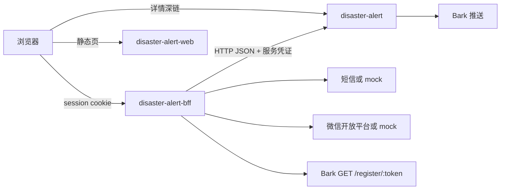

# 账号登录与设备绑定

日期：2026-09-01

终端用户先登录账号，再把 Bark token 绑到该账号下，按设备管理订阅和通知。登录方式：手机号 OTP、微信网页扫码。认证与设备资产在独立 BFF 仓库；`disaster-alert` 仍只按设备存订阅并推送。

## 1. 目标与非目标

### 目标

- 手机号 OTP 与微信扫码都能单独开户，之后可在设置里互绑。
- 登录态是 BFF 的 HttpOnly session cookie，不再把 Bark token 当站点身份。
- 一个账号可绑多台设备；每台设备自己的地点、规则、通知。
- 用户只输入 token；BFF 用实例级 Bark `base_url` 调用 `GET /register/{token}`，成功后保存。
- 浏览器订阅读写只打 BFF；BFF 查映射后用 HTTP JSON 调 Rust。
- 未配置微信 / 短信密钥且 `AUTH_MOCK=true` 时走 mock；生产关闭 mock 并配置真密钥。

### 非目标

- 飞书登录。
- 运营接口 `/api/admin/*` 鉴权。
- 从 Bark 测试链接抽取 token。
- 用户或账号配置 Bark `base_url`。
- 账号自动合并（手机号 / unionid 已被另一账号占用时不合并）。
- 把 Better Auth 嵌进 Rust 进程。
- 浏览器继续用 `Authorization: Bearer <bark token>` 写订阅。

## 2. 系统边界

三个仓库、三个进程，主机反代合成一个 HTTPS 站点。

| 仓库 | 进程 | 负责 | 不负责 |
| --- | --- | --- | --- |
| 新建 `disaster-alert-bff` | Node/TS + Better Auth | 唯一用户表、session、OTP、微信、`user_id → token`、订阅代理 | 匹配、烈度、发推送 |
| `disaster-alert-web` | nginx 静态 | 登录页、设备列表、订阅 UI | 用户表、token 目录 |
| `disaster-alert` | Axum | 按设备存订阅、匹配、推送、通知详情 | 用户、登录、谁拥有哪台设备 |

BFF 到 Rust 用 HTTP JSON，复用现有订阅契约，不引入 Thrift/gRPC。

反代：

- `/`：静态网页。
- `/api/auth`、`/api/devices`、`/api/settings`、浏览器用的订阅读写 / 退订 / 模拟推送 / 该设备投递查询：BFF。
- `/api/incidents/...`、`/api/status`、`/api/subscription-options`、`/api/reverse-geocode`、`/api/history`、`/health`：仍可直达 Rust（公开只读或详情深链，不携带 Bark token 当身份）。
- 网页不再调用 `/api/bark-urls`。
- Rust 写订阅只绑内网，且必须带 BFF 服务凭证。

## 3. 登录与会话

Better Auth 发 **HttpOnly、Secure、SameSite=Lax** cookie。浏览器只跟 BFF 要这份 cookie。

两种方式都可单独开户。微信给不了手机号，扫码后不强制 OTP；未绑手机也可去绑设备。飞书不做。

### 手机 OTP

1. 用户提交中国大陆 11 位手机号。
2. BFF 生成验证码，经短信适配器发送。
3. 未配置阿里云 / 腾讯云密钥时走 mock：验证码写 BFF 日志；仅当 `AUTH_MOCK=true` 时接受固定码 `000000`。
4. 校验通过则创建或找回该手机号用户，写下 cookie。
5. 同一号码发送间隔至少 60 秒；每小时上限 5 次；连续校验失败 5 次作废本次挑战。

### 微信扫一扫

登录页内嵌二维码（开放平台 WxLogin JS，`scope=snsapi_login`），不整页跳转。扫码后微信把 `code` 回给 BFF，换用户信息，按 **unionid** 开户或登录；没有 unionid 则用 openid。

未配置网站应用 AppID 且 `AUTH_MOCK=true`：BFF 发一次性票据，页上显示开发用码，提供「模拟确认」，确认后写 cookie。生产环境禁止 mock。

### 登录之后

cookie 有效即已登录。`/` 不再把 Bark token 当登录。废弃网页 localStorage 键 `disaster_bark_key` 作为登录态。登出只清 BFF cookie，不删设备资产，也不删 Rust 侧订阅。通知详情 `/incidents/...` 不登录。

## 4. 设备资产与订阅代理

Bark token 是账号资产，不是登录凭据。产品文案用「设备 / Bark token」，不用「Bark Key 登录」。

### 固定 Bark 地址

全站一个 `BARK_BASE_URL`（BFF 环境变量）。设备表不存 `base_url`。用户界面没有 Bark 服务器输入，也不再请求 `/api/bark-urls` 做选择。BFF 调 Rust 时用该配置填 `destination.base_url`。

### 绑定

用户只在表单里主动输入 token 字符串（可粘贴，但不解析测试链接）。格式与现网 Bark Key 相同：22 位字母或数字，先本地校验再请求 Bark。BFF：

1. 校验当前 session。
2. 对 `{BARK_BASE_URL}/register/{token}` 发 **GET**（Bark 官方「key 是否已注册」；不是带 APNs `device_token` 的 `POST /register`）。
3. 仅 200 时写入设备表。
4. 同一 `token` 全局只能属于一个账号：已属本账号则幂等成功；已属他人则拒绝，不泄露对方身份。

`GET /register/{token}` 超时或 5xx：不写入，提示稍后重试，不当成「token 无效」。4xx：不写入，提示 token 未在推送服务注册或无效。

默认设备名：`设备` + 现有数量加一，用户可改名。

### 使用

点某一台设备后进入该设备的订阅页。订阅读写、退订、模拟推送、该设备投递查询：浏览器只带 cookie 打 BFF；BFF 确认设备属于当前用户，再 HTTP JSON 调 Rust，带上 `BARK_BASE_URL` 与该 token。Rust 仍按目的地覆盖写入，匹配管道不改。

无设备时不能进入订阅配置。

### 解绑

先请求 Rust 删除该目的地订阅，成功后再删 BFF 资产。Rust 失败则保持绑定，避免账号侧没了设备、推送还在。

### Rust 如何认 BFF

浏览器不得再用 Bark token 当写订阅凭证。Rust 写接口（订阅创建/覆盖、退订、模拟推送）只接受共享服务凭证（请求头 `Authorization: Bearer <BFF_SERVICE_TOKEN>`），与用户 cookie 不同。通知详情深链仍公开。

## 5. 页面与路由

未登录可访问 `/login` 与通知详情。其余业务页要求 cookie。

| 路径 | 作用 |
| --- | --- |
| `/login` | 手机 OTP + 微信内嵌码。成功后去 `/devices`。 |
| `/` | 已登录 → `/devices`；未登录 → `/login`。 |
| `/devices` | 设备列表：输入 token 添加、改名、解绑。 |
| `/devices/:id/subscribe` | 该设备的地点与规则。 |
| `/devices/:id/subscribe/test` | 该设备的测试推送。 |
| `/settings` | 给当前账号补绑手机号或微信。 |
| `/incidents/:incidentId/notifications/:token` | 详情深链，不登录。 |

顶栏显示已登录状态与当前设备名称。换设备回 `/devices`。登出回 `/login`。

`:id` 是 BFF 设备主键，不是 Bark token。访问他人设备返回 404。

## 6. 错误处理

不把验证码、Bark token、微信 `code` 写入日志正文。

| 领域 | 情况 | 行为 |
| --- | --- | --- |
| 登录 | 手机号不是 11 位数字 | 不发短信 |
| 登录 | 发送过频 / 小时上限 | 提示等待，不发 |
| 登录 | 短信供应商失败且非 mock | 「验证码发送失败」 |
| 登录 | 验证码错、过期、次数用尽 | 作废挑战，需重发 |
| 登录 | 微信码过期、取消、code 作废 | 刷新二维码，不建半截用户 |
| 登录 | 微信失败且非 mock | 扫码不可用，OTP 仍可用 |
| 登录 | session 过期 | 回 `/login`，设备与 Rust 订阅保留 |
| 设备 | token 不是 22 位字母或数字 | 不请求 Bark，不写入 |
| 设备 | `GET /register/{token}` 非 200 | 不写入 |
| 设备 | 解绑时 Rust 删订阅失败 | 不解绑 |
| 订阅代理 | cookie 无效 | 401，前端回登录 |
| 订阅代理 | Rust 超时或挂 | 502，保留未保存稿 |
| 订阅代理 | Rust 业务错误（地点过多等） | 原样转给前端 |
| 订阅代理 | `INSTANCE_TERMS_ACCEPTED=false` | 拒绝新订阅，与现网一致 |
| 设置 | 手机号或 unionid 已是另一账号 | 不合并，提示已在其他账号使用 |

`AUTH_MOCK=true` 才允许固定验证码和模拟扫码。生产必须关闭 mock；配了真 AppID / 短信密钥时不得再用 mock 混过。

## 7. 数据

BFF 使用 SQLite（单 ECS 单实例）。Better Auth 表：user、account、session、verification。另建设备表：

- `id`：主键（UUID），供 URL `/devices/:id` 使用
- `user_id`
- `token_ciphertext`：AES-256-GCM 加密存放，密钥为环境变量 `DEVICE_TOKEN_ENCRYPTION_KEY`
- `token_hash`：HMAC-SHA256（同一密钥），用于全局唯一约束和查找；密文带随机 nonce，不能当唯一键
- `name`
- `created_at` / `updated_at`

无 `base_url` 列。用户档案不进入 Fjall。

Rust / Fjall 仍按 `NotificationDestination { base_url, device_key }` 存订阅。此处 `device_key` 即用户输入的 token，仅作推送目的地字段，不作登录身份。

## 8. 配置

BFF：

- `BARK_BASE_URL`：固定 Bark 服务根地址
- `WECHAT_APP_ID` / `WECHAT_APP_SECRET`：空则微信 mock（需 `AUTH_MOCK=true`）
- 短信供应商密钥：空则 OTP mock（需 `AUTH_MOCK=true`）
- `AUTH_MOCK`：生产为 `false`
- `DISASTER_ALERT_BASE_URL`：Rust 内网基址
- `BFF_SERVICE_TOKEN`：调用 Rust 写接口的共享凭证
- `DEVICE_TOKEN_ENCRYPTION_KEY`：设备 token 静态加密
- Better Auth 密钥与 cookie 相关变量
- BFF 自身 `/health` 供编排探活

Rust：校验同一 `BFF_SERVICE_TOKEN`；写订阅接口拒绝无此凭证的请求。

## 9. 测试

默认不打真实微信、短信、Bark。BFF 测试将它们替换为端口。

BFF：OTP 发送对象与限流；微信 mock 票据；绑定仅接受 token 字符串且依赖 `GET /register/{token}` mock；代理时未登录或非本人设备则 Rust 收不到请求；解绑失败回滚；补绑冲突不合并。

网页：登录与未登录跳转；设备页只有 token 输入，无链接解析、无 `base_url` 选择；订阅请求不带 Bark token；详情页不要求登录。

Rust：无 BFF 凭证的写订阅被拒；有凭证时现有订阅/匹配/推送测试仍通过；详情深链不变。

## 10. 实现顺序（仓之间）

1. 新建 `disaster-alert-bff`：Better Auth、OTP、微信、设备表、`GET /register/{token}`、订阅 HTTP 代理、mock。
2. `disaster-alert`：写接口改验 BFF 服务凭证；浏览器 Bearer Bark token 写订阅失效。
3. `disaster-alert-web`：`/login`、`/devices`、订阅改打 BFF；去掉 Bark Key 登录会话。
4. 反代与部署：三个容器，cookie 同域。

匹配、数据源、Bark 推送内容格式不在本设计内修改。

## 11. BFF 工程架构

独立仓库 `disaster-alert-bff`。一个 Node 进程：**Hono + Better Auth + SQLite（better-sqlite3 / Kysely）**。不引入 Next、Nest、Prisma。测试 Vitest，对 `app.request()` 发请求。监听 `30012`，避免和 API `30010`、网页 `30011` 冲突。

| 路径 | 职责 |
| --- | --- |
| `src/app.ts` | 组装路由、CORS、session 中间件 |
| `src/server.ts` | 读配置、listen |
| `src/auth/index.ts` | betterAuth：`phoneNumber` + 可选 wechat，`basePath` `/api/auth` |
| `src/devices/` | 资产表与 `/api/devices` |
| `src/subscribe-proxy/` | cookie → 设备 → 带服务凭证调 Rust |
| `src/settings/` | 补绑手机 / 微信 |
| `src/bark/register.ts` | `GET {BARK_BASE_URL}/register/{token}` |
| `src/sms/` | 真短信或 mock |
| `src/wechat/` | mock 扫码票据；真扫码走 Better Auth wechat |
| `src/rust/client.ts` | 内网 HTTP JSON |
| `src/crypto/device-token.ts` | AES-256-GCM 与 HMAC |

生产与网页同域反代，cookie `SameSite=Lax`。开发时 Vite 把 `/api/auth`、`/api/devices`、订阅读写代理到 BFF，公开只读仍代理到 Rust。
