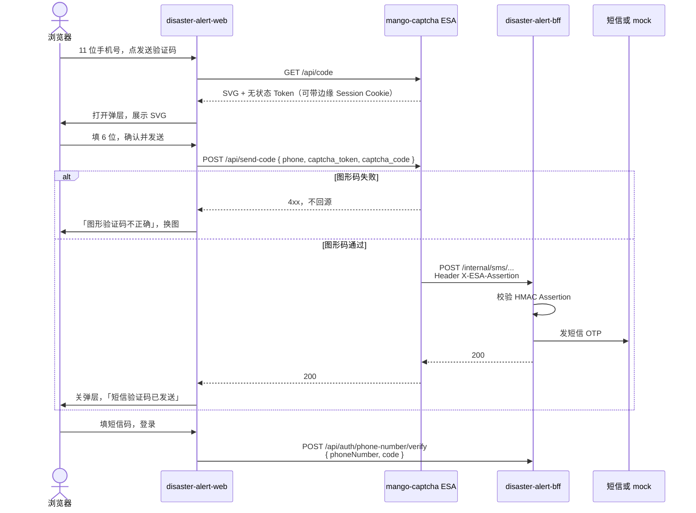

# 登录图形验证码技术说明

日期：2026-09-08

视觉与交互以 [2026-09-07-login-qr-field-design.md](./2026-09-07-login-qr-field-design.md) 为准。本文按 [mango-captcha](https://github.com/luyi2008/mango-captcha) README 写实现边界。

mango-captcha 是自部署的 **阿里云 ESA 边缘函数**：纯 TypeScript + SVG + Web Crypto，无 KV。图形码在边缘生成并校验；通过后签发短时 HMAC Assertion，再回源 SMS API。源站**不信任客户端字段**，只信 `X-ESA-Assertion`。CAPTCHA 失败时边缘直接 4xx，**不会** `fetch` 源站。

## 1. 目标与非目标

### 目标

- 登录页点「发送验证码」前过 6 位 SVG 数字码（弹层）。
- 浏览器把「取图 / 验图形并发送短信」打到 mango-captcha 边缘入口，不绕过边缘去公网 `send-otp`。
- BFF 作为 `ECS_ORIGIN`，只暴露内网 `/internal/sms/*`，校验 Assertion 后再走现网短信与 Better Auth。
- 微信扫码不过图形码。

### 非目标

- 在本仓库或 BFF 里重画、重验图形码。
- reCAPTCHA / Turnstile / hCaptcha / 极验。
- 把 CAPTCHA 状态写入 Edge KV。
- 改微信 mock、设备绑定、Rust 匹配。
- 设置页补绑手机（可复用同一边缘发送链，UI 另开任务）。

## 2. 进程与数据流

```text
浏览器
  → ESA Edge Function（mango-captcha：CAPTCHA + 边缘限流 + Assertion）
      → 源站 SMS API（BFF，由 ECS_ORIGIN 配置）
```



| 进程 | 入口 | 负责 | 不负责 |
| --- | --- | --- | --- |
| 静态页 | `:30011` / Vite `:5173` | 弹层 UI、本地 11 位校验、调边缘 `/api/code` 与 `/api/send-code` | 存答案、发短信、校验 Assertion |
| mango-captcha | 生产 ESA；本地 `:43141` | SVG、无状态 Token、边缘限流、验码、签发 Assertion、回源 | 短信通道、Better Auth 会话 |
| BFF | 公网 `/api/auth/*`；内网 `/internal/sms/*` | 验 Assertion、发短信、OTP verify、session cookie | 画图、验图形 |
| disaster-alert | `:30010` | 不变 | 登录、验证码 |

短信 **verify** 仍走现网 BFF `POST /api/auth/phone-number/verify`（Better Auth 写 cookie）。边缘的 `POST /api/verify-code` 是转发源站用的；本登录页不必改走它，除非以后要把 verify 也藏到内网。图形码只门闩 **发送**。

公网 `POST /api/auth/phone-number/send-otp` 必须关掉或一律 403。否则客户端可绕过边缘直接刷短信。发送只允许：ESA → BFF `/internal/sms/*`。

## 3. mango-captcha 边缘 API

本地：`http://127.0.0.1:43141`（仅 API）。README 摘要：

| 方法 | 路径 | 说明 |
| --- | --- | --- |
| GET | `/api/code` | 返回 SVG + 无状态 Token |
| POST | `/api/send-code` | 边缘验 CAPTCHA，通过后回源发短信 |
| POST | `/api/verify-code` | 校验短信验证码（转发源站）；本登录页不用 |
| GET | `/api/health` | 存活检查 |

Token 无状态（HMAC），TTL 默认 `CAPTCHA_TTL_SECONDS=120`。Assertion TTL 默认 `ASSERTION_TTL_SECONDS=30`。

可选边缘 Cookie：`SESSION_COOKIE_NAME`，默认 `session`。这会和 Better Auth 的 session cookie **撞名**。部署时改成独立名字（例如 `mango_captcha`），Path 尽量只覆盖边缘路由。

JSON 字段按 mango-captcha OpenAPI：GET 解析 `captcha_token` + `svg`（仍兼容 `token` / `image` 等别名）；`POST /api/send-code` 发送 `{ phone, captcha_token, captcha_code }`，`phone` 为 11 位大陆号（不带 `+86`），`credentials: "include"` 带上边缘 Session Cookie。类型里没有正确答案。语义上需要：

| 步骤 | 浏览器必须拿到 / 送出 |
| --- | --- |
| GET `/api/code` | 可内联的 SVG（字符串或 data URI）、后续 POST 要用的 `captcha_token` |
| POST `/api/send-code` | `{ phone, captcha_token, captcha_code }`；`credentials: "include"` |
| 4xx | `error`：`CAPTCHA_REQUIRED` / `CAPTCHA_INVALID` / `CAPTCHA_EXPIRED` / `INVALID_PHONE` |

「换一张」再 `GET /api/code`，丢掉旧 Token。

## 4. 源站（BFF）内网契约

ESA 变量 `ECS_ORIGIN` 指向 BFF 内网基址。安全组只放行 ESA 回源。不要把 `/internal/sms/*` 挂到公网反代。

BFF 与边缘共用 `ASSERTION_SECRET`（独立随机串，勿复用 `CAPTCHA_SECRET`）。请求头：`X-ESA-Assertion`。伪造成功的 Assertion 必须拒绝。

路径以 mango-captcha 回源 URL 为准（README 写 `/internal/sms/*`）。BFF 至少提供「发短信」：

1. 校验 Assertion 签名、过期（默认 30s）、声明中的手机号。
2. **以 Assertion 里的手机号为准**，忽略或交叉验证 body；不一致则 401/403，不发短信。
3. 通过后再走现网 OTP 限流（60s、每小时 5 次等）和短信适配器 / `AUTH_MOCK`。

`AUTH_MOCK=true` 只影响源站短信（日志里的固定码 `000000`）。图形码仍走真实边缘（本地 `npm run dev` 或 ESA）。不要在 BFF 里 stub 一张假图给生产网页。

## 5. 同域与开发代理

生产两种挂法（选一种）：

- **路径反代**：站点域名把 `/api/code`、`/api/send-code`（及可选 `/api/health`）转到 ESA；其余 `/api/auth`、`/api/devices` 仍到 BFF。
- **ESA 打头**：该站由 ESA 接入，CAPTCHA 路径进边缘函数，其它回源。

本仓库 Vite 必须把这几条写在通配 `/api` → Rust **之前**：

```ts
"/api/code": proxyTo("http://127.0.0.1:43141"),
"/api/send-code": proxyTo("http://127.0.0.1:43141"),
"/api/auth": proxyTo(bffOrigin),
```

本地同时起：mango-captcha `:43141`，BFF `:30012`，网页 `:5173`。ESA `ECS_ORIGIN=http://127.0.0.1:30012`（或边缘函数能访问的 BFF 地址）。

## 6. 前端落点（本仓库）

视觉稿：`docs/design/login-qr-field.html`。

| 文件 | 职责 |
| --- | --- |
| `src/auth/captcha.ts` | `GET /api/code`、`POST /api/send-code`；解析 Token 与 SVG；类型里没有正确答案 |
| `src/components/CaptchaDialog.tsx` | 弹层：记录纸里渲染 SVG、六格井、换一张、确认并发送、取消 |
| `src/pages/LoginPage.tsx` | 非法号不请求；打开弹层；确认走 `send-code`；登录仍 `verify` |
| `vite.config.ts` | `/api/code`、`/api/send-code` → `:43141` |
| `src/styles/ds.css` | 底栏 / 居中卡；标签行右对齐；登录钮与「已发送」间距 |
| `src/pages/LoginPage.test.tsx` | 见 §8 |

弹层用现成 `Dialog`，窄屏加底栏 class。SVG 来自本系统边缘，放进 `.captcha-tape`（`img` data URI 或内联 SVG）。`alt=""`，可见标题「图形验证码」。

交互：

1. 「发送验证码」：先 `normalizeMainlandPhone`；失败不请求 `/api/code`。
2. 冷却中：不打开弹层。
3. 合法：`GET /api/code`（`credentials: "include"`），成功再打开 Dialog，聚焦六格（`autocomplete=off`，`inputMode=numeric`）。
4. 「换一张」再 `GET /api/code`，清空六格，换 Token。
5. 满 6 位可自动提交，或点「确认并发送」→ `POST /api/send-code`。
6. 边缘 4xx：弹层不关，清空格子，再取一张图。
7. 200：关层，「短信验证码已发送」，60s 冷却。
8. 取消 / 遮罩 / Escape：关层，不 `send-code`。
9. 登录：`POST /api/auth/phone-number/verify`；未发送：「请先发送短信验证码」。

文案与设计稿相同。登录按钮与「短信验证码已发送」至少隔 24px。

## 7. 安全

- 前端、BFF 日志、边缘日志正文都不写图形答案、Assertion、短信码。
- 图形失败不回源，保护短信预算。
- 公网禁止无 Assertion 的发送接口。
- `CAPTCHA_SECRET` 与 `ASSERTION_SECRET` 分开生成（`openssl rand -base64 32`）。
- 边缘 Cookie 不要占用 Better Auth 的 cookie 名。
- 回源只放行 ESA；`/internal/sms/*` 不进公网反代。

## 8. 测试

本仓库：

- 非法手机号：不请求 `/api/code`，也不请求 `/api/send-code`。
- 点发送：`GET /api/code`，dialog 里出现 SVG。
- 换一张：第二次 `GET /api/code`，Token 更换。
- 确认：`POST /api/send-code` 带 `{ phone, captcha_token, captcha_code }`，`credentials: "include"`。
- `send-code` 4xx：dialog 仍开，随后再 `GET /api/code`。
- `send-code` 200：dialog 关闭，「短信验证码已发送」。
- 取消：无 `send-code`。
- 登录仍 `POST /api/auth/phone-number/verify`；mock 码 `000000` 可过。
- 微信路径不请求 `/api/code`。
- 不请求公网 `/api/auth/phone-number/send-otp`。

BFF：无 Assertion 或伪造 Assertion 的 `/internal/sms/*` 被拒，且不调短信适配器。

mango-captcha 仓库已覆盖 Token 真假、过期、跨 Session、错误答案不回源、Assertion 伪造。

## 9. 实现顺序

1. **mango-captcha**：从 `src/` 钉死 JSON 字段；配置 `ECS_ORIGIN`、两套密钥。
2. **disaster-alert-bff**：实现 `/internal/sms/*` + Assertion；公网 `send-otp` 关闭。
3. **disaster-alert-web**：弹层改打 `/api/code`、`/api/send-code`；Vite / 反代分流；更新 `openapi.yaml`。

先源站内网发送，再指 ESA `ECS_ORIGIN`，最后改网页。不要先发网页去打尚不存在的边缘路由。

## 10. ESA 函数变量（对照 README）

| 变量 | 必须 | 说明 |
| --- | --- | --- |
| `CAPTCHA_SECRET` | 是 | CAPTCHA Token HMAC，至少 16 字符 |
| `ASSERTION_SECRET` | 是 | ESA→源站 Assertion HMAC，与 BFF 一致 |
| `ECS_ORIGIN` | 是 | BFF 内网基址 |
| `CAPTCHA_TTL_SECONDS` | 否 | 默认 120 |
| `ASSERTION_TTL_SECONDS` | 否 | 默认 30 |
| `SESSION_COOKIE_NAME` | 否 | 默认 `session`；生产请改名避免和登录 cookie 冲突 |
