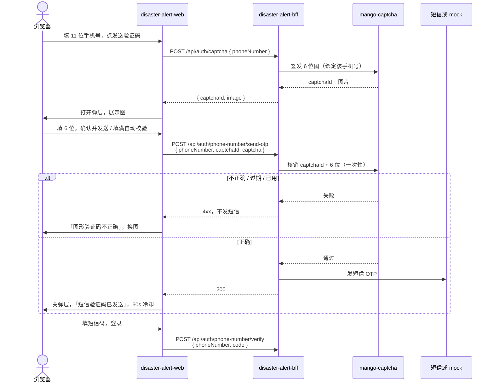

# 登录图形验证码技术说明

日期：2026-09-08

视觉与交互以 [2026-09-07-login-qr-field-design.md](./2026-09-07-login-qr-field-design.md) 为准（弹层已定稿）。本文写实现边界、调用链和契约。

图形验证码由独立服务 **[mango-captcha](https://github.com/luyi2008/mango-captcha)** 签发和核销。浏览器**不直连**该服务，只打 `disaster-alert-bff`。BFF 用适配器调 mango-captcha，通过后再发短信。

本稿撰写时本环境读不到 mango-captcha 仓库（GitHub 404）。**浏览器 ↔ BFF 的路径和字段以本文为准。** mango-captcha 的 URL 与 JSON 由 BFF 适配器对照其 README 钉死，能力集合见 §3。

## 1. 目标与非目标

### 目标

- 登录页点「发送验证码」前必须过 6 位图形码。
- 图形码弹层：窄屏底栏、宽屏居中卡；主表单仍是手机号 + 短信码 + 登录。
- 微信扫码段保持现网行为，不过图形码。
- 图形答案只存在 mango-captcha / BFF 服务端；前端只拿到图。

### 非目标

- 浏览器直连 mango-captcha。
- 滑块、点选汉字、邮件码。
- 改短信 verify、session cookie、微信 mock。
- 本仓库实现 mango-captcha 本身。
- 设置页补绑手机（可复用同一 BFF 门闩，UI 另开任务）。

## 2. 进程与数据流

四个进程。网页仍是静态站点；验证码图和核销都经 BFF。



| 进程 | 仓库 | 负责 | 不负责 |
| --- | --- | --- | --- |
| 静态页 | `disaster-alert-web` | 弹层 UI、本地 11 位校验、带 `captchaId` 调 BFF | 存答案、调 mango-captcha |
| BFF | `disaster-alert-bff` | 把手机号绑到挑战、核销成功才发短信、限流 | 画图、存图形答案 |
| 图形码 | `mango-captcha` | 生成 6 位数字图、一次性核销、TTL | 短信、session |
| 匹配/推送 | `disaster-alert` | 不变 | 登录、验证码 |

反代：浏览器仍只打站同域 `/api/auth/*` → BFF。不要把 mango-captcha 暴露到公网路径。

开发代理：Vite 已把 `/api/auth` 转到 BFF `30012`。新增 captcha 路由走同一前缀，**不必**再加 mango-captcha 的 proxy。

## 3. mango-captcha 能力（适配器）

BFF 内一个 `CaptchaClient`，只依赖这些能力。路径名对照 [mango-captcha](https://github.com/luyi2008/mango-captcha) README 填写。

| 能力 | 输入 | 输出 | 规则 |
| --- | --- | --- | --- |
| 签发 | 可选关联键（BFF 传规范化手机号） | `id`、图片（png/svg 或 data URI）、过期时间 | 图上是 **6 位数字**，不是汉字 |
| 核销 | `id` + 用户输入的 6 位 | 通过 / 不匹配 / 过期 / 已用 / 找不到 | **一次性**；失败也作废或立刻换新，禁止无限重试同一 id |
| 健康 | 无 | 活着 | BFF `/health` 可不强依赖；发短信路径必须失败则关 |

建议 BFF 环境变量（名可按 BFF 惯例微调）：

| 变量 | 用途 |
| --- | --- |
| `MANGO_CAPTCHA_BASE_URL` | mango-captcha 根地址，内网 |
| `MANGO_CAPTCHA_TOKEN` | 若该服务要服务凭证 |
| `AUTH_MOCK` | 现网短信 mock；**生产**在未配置 `MANGO_CAPTCHA_BASE_URL` 时不得发短信 |

生产：未配 mango-captcha 则 `send-otp` 直接 503，文案「图形验证码暂不可用」，OTP 仍可走已发出的码（若有），但新发送拒绝。

开发：`AUTH_MOCK=true` 且未配 URL 时，BFF 可用内存 stub 签发一张 6 位数字图（答案只打 BFF 日志，不进响应），好让网页单独开发。Stub 不得进生产。

适配器要把 mango 的图规范成网页可用的 **data URI**（`data:image/png;base64,...` 或 `data:image/svg+xml,...`），避免再开一个带 cookie 的图片 URL。

## 4. 浏览器 ↔ BFF 契约

现网短信 verify 不变。只增加签发，并扩展 `send-otp`。

响应包络跟现网 BFF：`{ success, data?, message? }`。`credentials: "include"`。

### 4.1 签发 `POST /api/auth/captcha`

请求：

```json
{ "phoneNumber": "13812345678" }
```

`phoneNumber` 规则与现网 OTP 相同：大陆 11 位，可带 `+86`。非法号 **404/400 均可，但不要签发**，前端本就不会对非法号弹层。

成功 200：

```json
{
  "success": true,
  "data": {
    "captchaId": "opaque-id",
    "image": "data:image/png;base64,..."
  }
}
```

| 失败 | HTTP | `message`（给用户） |
| --- | --- | --- |
| 手机号非法 | 400 | 请输入 11 位大陆手机号 |
| 签发过频 | 429 | 操作过于频繁，请稍后再试 |
| mango-captcha 挂了 | 503 | 图形验证码暂不可用 |

「换一张」再打同一接口，旧 `captchaId` 作废（BFF 调 mango 作废或忽略到期即可）。

### 4.2 发短信 `POST /api/auth/phone-number/send-otp`

现网 body `{ phoneNumber }` **不再够**。新 body：

```json
{
  "phoneNumber": "13812345678",
  "captchaId": "opaque-id",
  "captcha": "481702"
}
```

`captcha`：恰好 6 位数字。缺字段、非 6 位：400，不调短信。

BFF 顺序：

1. 规范化手机号。
2. 核销 mango-captcha：`captchaId` + `captcha`，且挑战必须是为**这个手机号**签发的。
3. 核销失败：4xx，**不发短信**。
4. 核销成功：走现网短信限流（60s / 小时 5 次等），再发 OTP。
5. 短信供应商失败：现网文案「验证码发送失败」；图形码已核销，前端必须换新图才能再发。

| 失败 | HTTP | `message` |
| --- | --- | --- |
| 缺 captchaId / captcha | 400 | 请输入图形验证码 |
| 不匹配 / 过期 / 已用 / 非该手机号 | 400 | 图形验证码不正确 |
| 现网发送过频 | 429 | 现网等待文案 |
| mango-captcha 挂了 | 503 | 图形验证码暂不可用 |
| 短信失败 | 5xx | 验证码发送失败 |

### 4.3 登录 `POST /api/auth/phone-number/verify`

不变：`{ phoneNumber, code }`。图形码不参与。

## 5. 前端落点（本仓库）

视觉稿：`docs/design/login-qr-field.html`。

| 文件 | 职责 |
| --- | --- |
| `src/auth/captcha.ts` | `issueCaptcha(phone)` / 解析 `captchaId`+`image`；不把答案放进类型 |
| `src/components/CaptchaDialog.tsx` | 弹层：记录纸 ``、六格井、换一张、确认并发送、取消 |
| `src/pages/LoginPage.tsx` | 非法号不请求；打开弹层；确认时带 `captchaId`+`captcha` 调 `send-otp` |
| `src/styles/ds.css` | `.captcha-sheet` 窄屏底栏 / 宽屏居中；标签行右对齐；登录钮与「已发送」间距 |
| `src/pages/LoginPage.test.tsx` | 见 §7 |

弹层用现成 shadcn `Dialog`。`<640px` 给 `DialogContent` 加底栏 class，不要第二套模态。

交互（与设计稿一致）：

1. 「发送验证码」：先 `normalizeMainlandPhone`；失败写手机号槽，**不** `POST /captcha`。
2. 冷却中：不打开弹层。
3. 合法且未冷却：`POST /captcha`，成功再 `open` Dialog，聚焦六格（隐藏 input，`autocomplete=off`，`inputMode=numeric`）。
4. 图放进 `.captcha-tape` 的 ``（有可见标题，避免读出数字）。
5. 「换一张」再次 `POST /captcha`，清空六格，换 `captchaId`。
6. 满 6 位可自动提交；也可点「确认并发送」。
7. `send-otp` 400「图形验证码不正确」：弹层不关，清空格子，自动换一张。
8. 200：关层，短信槽「短信验证码已发送」，60s 冷却。
9. 取消 / 遮罩 / Escape：关层，不发短信，不开始冷却。
10. 登录仍走 `verify`；未发短信：「请先发送短信验证码」。

「发送验证码」与标签「短信验证码」同一行靠右。「换一张」与说明同一行靠右。登录按钮与「短信验证码已发送」至少隔 24px。

## 6. 安全与隐私

- 响应、前端 state、前端日志都不得出现图形正确答案。
- 访问日志不要把 `captcha` 当 query；用 POST body，BFF 日志打码。
- 挑战绑定规范化手机号，避免一图用在另一个号码上刷短信。
- 核销一次性；换图作废旧 id。
- 签发与核销都要限流（BFF 层），保护 mango-captcha 和短信预算。
- 生产关闭 stub；`AUTH_MOCK` 不能绕过「先核销再发短信」这条链（stub 也必须核销）。

## 7. 测试

本仓库（Vitest）：

- 非法手机号：不请求 `/api/auth/captcha`，也不请求 `send-otp`。
- 点发送：先 `POST /captcha`，出现 dialog 与 ``。
- 换一张：第二次 `POST /captcha`，`captchaId` 换成新的。
- 确认：`send-otp` body 含 `phoneNumber`、`captchaId`、6 位 `captcha`，`credentials: "include"`。
- `send-otp` 400 图形错误：dialog 仍开着，随后会再签发。
- `send-otp` 200：dialog 关闭，出现「短信验证码已发送」。
- 取消：无 `send-otp`。
- 现网 verify `000000` 仍登录成功（mock）。
- 微信扫码路径不请求 captcha。

BFF（另一仓）：

- 核销失败不调用短信适配器。
- `captchaId` 与手机号不一致则失败。
- mango-captcha 5xx → 503，不发短信。

## 8. 实现顺序

1. **mango-captcha**：确认签发/核销 HTTP，6 位数字图，一次性 TTL。
2. **disaster-alert-bff**：`CaptchaClient`、`POST /api/auth/captcha`、扩展 `send-otp`；生产无 URL 则拒绝发送。
3. **disaster-alert-web**：弹层 + 契约；更新 `docs/openapi.yaml` 快照。
4. 反代仍只暴露 BFF 的 `/api/auth`。

三仓独立发版。先发 BFF（旧网页暂不能发短信，直到网页带上 `captchaId`），或短暂停用发送。不要先发网页（新字段会被旧 BFF 忽略或 400）。

## 9. 文案（实现时用）

与设计稿相同：图形验证码 / 看图输入 6 位数字，正确后发送短信 / 换一张 / 确认并发送 / 取消 / 请输入图形验证码 / 图形验证码不正确 / 短信验证码 / 发送验证码 / 短信验证码已发送 / 请先发送短信验证码 / 请输入短信验证码 / 请输入 11 位大陆手机号 / 图形验证码暂不可用。
