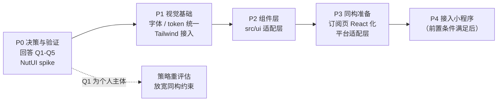

# 实施计划：UI 改版与小程序同构准备

**状态：待评审。本文不含任何代码改动，评审通过后才进入实施。**

配套文档：选型论证见 [ui-stack-selection.md](ui-stack-selection.md)，任务清单见 [ui-redesign-todo.md](ui-redesign-todo.md)。

---

## 1. 目标与范围

### 1.1 目标

| # | 目标 | 验收方式 |
| --- | --- | --- |
| G1 | 统一两个页面的设计语言，改善观感 | 两页共用一套 token；视觉走查通过 |
| G2 | 引入成熟轻量的 CSS 框架 | Tailwind v4 接入，构建与测试无退化 |
| G3 | 引入开源 UI 组件库 | 组件通过 `src/ui/` 适配层统一导出 |
| G4 | 让代码具备快速同构小程序的条件 | 组件层无裸 DOM API；平台能力已抽边界 |

### 1.2 明确的非目标

- **本轮不引入 Taro，不产出小程序构建产物。** 理由见 [ui-stack-selection.md](ui-stack-selection.md) 第 8 节。
- 不优化地图渲染方案（但要抽出接口边界）。
- 不引入状态管理库。
- 不做 SSR / SEO。

### 1.3 计划的核心策略

**按「可同构」约束来设计，但把 Taro 接入推迟到前置条件满足之后。**

这样 G1–G3 的收益可以立刻拿到，而 G4 只以「设计约束」的形式存在，不引入任何工具链风险。

---

## 2. 阶段划分

每个阶段都必须**对 Web 独立有价值**，不依赖后续阶段才产生收益。这是为了保证任何一个阶段被中止时，已完成的工作不会浪费。

---

## 3. P0：决策与验证

**目的**：消除两个会推翻后续方案的未知项。此阶段不写业务代码。

### 3.1 待你回答的问题

见 [ui-stack-selection.md](ui-stack-selection.md) 第 9 节的 Q1–Q5。其中 **Q1（小程序主体是个人还是企业）优先级最高** —— 它可能反转整个技术方案。

### 3.2 需要做的技术验证（spike）

| 验证项 | 为什么必须先验证 | 产出 |
| --- | --- | --- |
| NutUI React 与 React 19 的兼容性 | 这是组件库方案最大的未知项。若不兼容，需在「降 React 18」「换组件库」「自建」之间重选 | 一次性 demo，结论写回选型文档 |
| Tailwind v4 目标浏览器覆盖 | v4 要求 Safari 16.4+ / Chrome 111+；若用户设备偏旧需降级方案 | 结合 Q4 的答复给出结论 |

spike 代码**不进主干**，只用于产出结论。

### 3.3 退出条件

- Q1–Q5 全部有答复。
- NutUI + React 19 的兼容性结论明确。
- 若 Q1 为个人主体 → **暂停 P3/P4，回到选型文档重评估**（届时 shadcn/ui + Radix 可能成为更优选，因为同构约束不再成立）。

### 3.4 决策点

| 决策 | 触发条件 | 分支 |
| --- | --- | --- |
| D1 | Q1 = 个人主体 | 放宽同构约束，组件库改选视觉质量最优方案 |
| D2 | NutUI 不兼容 React 19 | 优先「自建 + Tailwind」，而非降级 React |
| D3 | Q4 显示老旧设备占比高 | Tailwind v4 → v3，或改用 CSS Modules 退路 |

---

## 4. P1：视觉基础

**目的**：解决 G1、G2。这是本轮观感改善的主要来源。

### 4.1 范围

| 任务 | 说明 | 风险 |
| --- | --- | --- |
| 修字体栈 | `subscribe.css:40` 与 `:472` 的 Arial 前置 | 低，纯视觉，易回滚 |
| 统一设计 token | 按 Q2 的答复合并两套调色板；顺带消除 token 覆盖缺陷 | **中，会改变两页外观** |
| 详情页补深色模式 | 当前 `detail.css` 无深色模式 | 低 |
| 接入 Tailwind v4 | 跳过 Preflight + `@theme inline`，方案见选型文档 6.1 | 低，PoC 已验证 |

### 4.2 交付物

- `src/styles/theme.css`：token 单一真相源 + Tailwind 接入层。
- 两页共用统一调色板，`detail.css` 与 `subscribe.css` 不再各自声明 `:root`。
- `vite.config.ts` 接入 `@tailwindcss/vite`。

### 4.3 验收标准

- [ ] `npm run build` 通过，CSS 体积增量在 +5 kB（raw）以内
- [ ] `npm test` 12 个用例全部通过
- [ ] `npm run lint` 无新增告警（基线为 1 条）
- [ ] 产物中确认无 Tailwind Preflight 规则注入
- [ ] 产物中 `:root` 不再有重复且取值冲突的 token
- [ ] 浅色 / 深色两种模式下，两个页面视觉走查通过
- [ ] 订阅页与详情页的关键交互手动验证无回归

### 4.4 回滚方式

P1 的每一项都是独立提交，可单独 revert。Tailwind 接入不改动任何业务逻辑，回滚只需移除插件与 `theme.css`。

---

## 5. P2：组件层

**目的**：解决 G3。

### 5.1 范围

建立 `src/ui/` 适配层，约 10 个组件：Button、Input、Select、Switch、Dialog、Toast、Collapse、Badge、ListItem、Field。

实现策略取决于 P0 的 D2 决策：NutUI 兼容则以它为内部实现，否则基于 Tailwind 自建。**无论哪种，对外 API 由我们自己定义。**

### 5.2 交付物

- `src/ui/` 各组件及其单测。
- lint 规则：禁止业务代码直接 import 第三方组件库（`no-restricted-imports`）。

### 5.3 验收标准

- [ ] 业务代码不出现对第三方组件库的直接 import，由 lint 保证
- [ ] 每个组件有单测覆盖基本渲染与交互
- [ ] 组件内不出现 `document` / `innerHTML` / `querySelector`
- [ ] 深色模式下各组件表现正确

### 5.4 风险

| 风险 | 缓解 |
| --- | --- |
| NutUI 为 beta，可能有缺陷 | 适配层隔离；可逐组件替换为自建 |
| NutUI 桌面端观感一般 | 取决于 Q3；若桌面端重要则倾向自建 |

---

## 6. P3：同构准备

**目的**：解决 G4。**每一步对 Web 都独立有价值**，不是纯粹为小程序做的投资。

### 6.1 范围

| 任务 | 对 Web 的独立价值 |
| --- | --- |
| 订阅页 React 化（`toast` → `status` → `alerts` → `locations`） | 消除 `innerHTML` XSS 面、去掉手工 teardown、可测试性提升 |
| 抽平台适配层（storage / request / navigate） | 请求与存储逻辑集中，便于统一错误处理与测试 |
| 抽地图接口边界 | 解开 `locations.ts` 里 Leaflet 与状态机的耦合 |
| 按路由代码分割 | 详情页用户不再下载订阅页工作区（当前单 chunk 459 kB） |
| lint 禁止组件层裸 DOM API | 机制化保证，替代人工纪律 |

### 6.2 验收标准

- [ ] `src/subscribe/` 不再有命令式 DOM 模块，`shell.html` 已删除
- [ ] `SubscribeRuntime` 已移除
- [ ] 平台能力全部经适配层访问
- [ ] 产物按路由分割，详情页首屏 JS 显著小于当前 459 kB
- [ ] 全部既有测试通过，且新组件有对应测试

### 6.3 依赖

P3 的订阅页 React 化**是 P4 的硬前置**（小程序无 DOM）。顺序遵循 [subscribe-frontend.md](subscribe-frontend.md) 的既定风险排序。

---

## 7. P4：接入小程序

**目的**：真正产出小程序。**仅在前置条件全部满足后启动。**

### 7.1 前置条件（全部必须满足）

- [ ] P3 完成（订阅页已无 DOM 依赖）
- [ ] Q1 确认为企业/组织主体
- [ ] 类目审核可行性已确认（选型文档 7.4）
- [ ] React 19 与 Taro 的兼容路径已明确（选型文档 7.3）

### 7.2 范围

- 只把**订阅页**做成小程序。
- **详情页保持 H5**（Bark 深链无法可靠拉起小程序，见选型文档 7.2）。
- 地图补一份原生 `<map>` 实现。

### 7.3 风险

| 风险 | 应对 |
| --- | --- |
| Taro 官方仍不支持 React 19 | 二选一：降 React 18，或用社区 `vite-plugin-taro` |
| 类目审核不通过 | P4 中止；P1–P3 的成果不受影响（这是分阶段的意义） |

---

## 8. 风险总览

| # | 风险 | 影响 | 概率 | 缓解 |
| --- | --- | --- | --- | --- |
| R1 | Q1 为个人主体，同构目标不成立 | 高（推翻 P4 与部分选型） | 未知，**待确认** | P0 优先确认；P1–P3 对 Web 独立有价值，不会浪费 |
| R2 | 类目审核不通过 | 高（P4 中止） | 中 | P0 阶段先确认，避免技术做完才发现 |
| R3 | NutUI 不兼容 React 19 | 中（组件库重选） | 中 | P0 spike 先验；适配层隔离影响 |
| R4 | Tailwind v4 浏览器要求过高 | 中（需降级方案） | 低–中 | P0 结合 Q4 评估；CSS Modules 为退路 |
| R5 | token 统一改变外观，用户不适应 | 低 | 中 | 独立提交、可单独回滚；先出视觉稿确认 |
| R6 | 订阅页 React 化引入功能回归 | 中 | 中 | 逐模块替换；现有 12 个测试为护栏；每模块补测试 |

**R1 是最需要优先消除的。** 它不是技术风险，但会决定整个方案的形状。

---

## 9. 本计划的执行约定

根据沟通确认的流程：

1. **先出文档，评审通过后才动代码。** 本文与选型文档、TODO 清单构成评审材料。
2. 每个阶段开始前，确认该阶段范围与验收标准。
3. 代码改动按阶段拆分提交，每个逻辑改动独立成 commit，便于单独回滚。
4. 涉及视觉变化的改动（P1 的 token 统一）先出效果确认，再合入。

---

## 10. 当前状态

| 阶段 | 状态 | 阻塞 |
| --- | --- | --- |
| P0 | **进行中** —— 等待 Q1–Q5 答复 | 需要你的输入 |
| P1 | 未开始 | 等 P0（Q2 决定 token 方案，Q5 决定字体） |
| P2 | 未开始 | 等 P0（D2 决定组件库） |
| P3 | 未开始 | 等 P1、P2 |
| P4 | 未开始 | 等 P3 + Q1 + 类目审核确认 |

选型阶段做过的一次性 Tailwind PoC **已回退**，当前仓库代码与 `main` 一致，无任何未评审的改动。
